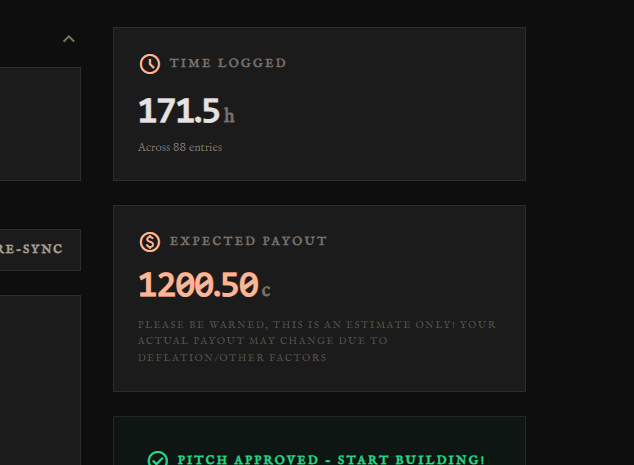

<!--
  This journal is auto generated by Hack Club Blueprint.
-->

# 2/25/2026 - Bought some stuff & checks and stuff  

_Time spent: 0.6h_  

Mostly just double-triple checked stuff and bought it!


So yeah, the thing is that one of the things was from a blocked category, so I had like get @jay to unblock it, but then he had to re block it, but the problem was I had 2 orders, so he had to do that twice...

Well anyways I probably did some other stuff but I forgot it all so...  

# 2/27/2026 6 PM - Rerouted a bunch of the bottom layer  

_Time spent: 1.9h_  

Basically, I want to put art onto the bottom layer, and thus I rerouted many signals so that the bottom is just mostly ground, on which its far safer to remove the soldermask


As you can see, there's only a bit of routing on the densest part of the board, but other than that its all gone!


Now time to actually get the art going!

By the way, most places were relatively easy, just switching the trace layer, but others required quite a bit of change.


I also tidied up this corridor so that the majority is in line with itself and thus doesn't affect the ground stitching around the ground plane too much.  

# 2/27/2026 9:36 PM - Artwork  

_Time spent: 0.7h_  

I added a bunch of new art, fully custom (except for the hackclub logo)

It took soooo long because in the beginning I was going to make a single PNG and import it, but I just ended up importing individual files and putting them in the right spot. It was just too hard to have one.


I'm going to clean up the backside a bit, but first I have to move all the Part-Identifiers so they are legible over this new silkscreen


  

# 2/27/2026 9:55 PM - Designators  

_Time spent: 0.4h_  

I moved all the designators on the top side so that they are readable with the new wavy lines. The backside will be done tomorrow, when I redo that silkscreen to not conflict with the hackclub logo.


Anyways, there just was this one spot with the microSD card where it was tough, but most of the other places were easy enough


  

# 3/2/2026 - Artwork & Suture/Stiching Vias  

_Time spent: 2.6h_  


First things first, I quickly fixed the artwork on the back side so that the hackclub logo wouldn't have lines going through it


However, on the front side I got feed back that the silkscreen was just a bit too much, especially with the ENIG art, and thus I removed it, even though I had moved all the designators...


 ### The hard part

So that was all good, just a bit of easy artwork. But, the stiching vias were _really_ bad this time, as for some reason the DRC was allowing the vias to be placed too close to each other, and then flagging them. So, I had to go through and remove each violating via by hand... (Some 50~60 vias)


> <small> btw my board now has 3000+ vias!! </small>

Anyways, after that, there was the headers for the speed and 2 IO (buttons, etc) that were sort of conflicting with the battery, so I re-arranged them.


 ### Debug Header

Reddit said that I should add the NRST pin broken out on the debug header, so that's what I did.


Required some wiring, including some on the bottom layer. (Which is my mostly empty one)  

# 3/3/2026 - Added Another FPC Connector  

_Time spent: 4.3h_  

This is basically just so that if in the future I want to have it connect to a daughter board, it will be able actually communicate. Because I didn't have access to STM32CUBEMX, I had to look through the datasheet to find out which pins (of the remaining) were the most capable so that I could actually use them. I settled on this setup:


> Note: STM/ESP32_SCK is actually PA1

So now, I was left with the daunting task of finding the ideal order (shown above) so that it would actually be possible to route. On my 5th revision, I found that.

---

Now to actually wire this monster up


As you can see, the majority of the lines look alr, and I might actually just change the two weird ones (on the bottom).

The biggest problem, however, is the fact that this is already the most dense part of the board, where the four layers are most full, so wiring an addition ~16 lines is not going to be fun. Thankfully, if absolutely need be, I can always use inner 4, which is supposed to be GND only...

 #### Some Time Later

Ok! I think I've settled on this setup for the pins:


Now time to route this all...

 ### ~~Routing~~ More double checking!

Here's (hopefully) the final thing.


_Now_ it's time for some routing

 ### Routing

(some time later)

Ok so here's what I have!


This is one heck of a dense board, with all four layers being quite well used: (L3,L4,L6)


Not gonna lie, but that was quite a bit easier than I was expecting. I did end up changing a bit of the schematic, so that it would actually be nicely usable, so here it is!


(Mostly just switching around a few pins to avoid loops)

Yeah well that was a full days work! Proud of what I got done.

Oh yeah, btw re-added the suture vias (the ones that connect between layers)


~~ALSO I NOTICED THAT ALL MY JOURNALS FROM THE PAST DAY ARE ALL GONE?????????????????????????????? Like 10 hrs of work dissapeared!!~~ Just a glitch  

# 3/4/2026 - Tested (& Received) E-INK DISPLAY!!!  

_Time spent: 2.3h_  

Firstly, I received the displays!!!!!


That last one might have looked weird ... that's my E-INK!

It was actually a pain to get it working. First, I connected it to my rpi Pico's wrong 3V3, so it wasn't getting power, then [the library](https://github.com/rdagger/MicroPython-2.9-inch-ePaper-Library/tree/master) was really weird and glitching out. So, I changed my library to Waveshare's official one, however I messed up and installed the 2.13 inch display one, not the [2.9 inch one](https://github.com/waveshareteam/Pico_ePaper_Code/blob/main/python/Pico_ePaper-2.9.py), so again it didn't work.

In between, I had messed up with which pins were SCK and MOSI, and kept getting the `Bad Pin` error, so that definitely wasn't nice.

All in all, it's really great it worked, but it took too much effort ... Hoping the LCDs are easier!  

# 3/10/2026 - LCD & E-INKing  

_Time spent: 4.5h_  

Alr, so, believe it or not, the LCD just worked first try!!!!!!

It was lowk so easy, took like 10 mins to wire it up (and double check and stuff) then I just found the official code and it just worked!!

While I'm at it, the screws also arrived, and hey, they fit!

And now the really time consuming part. E-INK custom text scaling!


Just so you know, I did, in fact, get it to work, but the thing is I just thought it would be as simple as just copying the LCD text scaler function over, and it would just work.

ye ofc it wasn't

But first, before I get to that part, I just wanted to talk about how I really goofed up in reading the E-INK code, so previously it would just drive the E-INK when the `vertical_write()` calls would come in, and not for the `horizontal_write()`, and I was really wondering why, and it turns out that I didn't change the SPI pins on the `Horizontal` class, just on the `Vertical` class.

Quick fix, just changed that, (but not so quick to find it, ofc) and now instead of waiting 10+ seconds for the screen to initialize, it just does so within a second!

So yeah, now that I had got that to initialize far faster (a problem I had been observing for quite a while, but was unsure of why), I decided that if my speedo was gonna be readable in bright sunlight, it would make most sense for the E-INK to be able to display speed, too.

Since, I needed it to be visible at a bit of a distance while shaking, I decided that I should find out how to make the text big enough to be readable. Hence, the problem

So I briefly touched upon how the LCD has a scaler, which it does, but the thing is that it's designed for a different setup, with colour displays and stuff.

So, I went looking online and I found [this.](https://github.com/orgs/micropython/discussions/16382)

Basically, it does the exact same thing, but somehow works (after much modding)

"What modding," you ask?

Well firstly, I had to actually _understand_ the code, and here's a rundown of what it does.

Put simply, it take micropython's framebuffer's built in font, and then reads it, by putting it into a new framebuffer and reading every pixel.

Then, it takes those readings, and draws rectangles that are the scale. So, if we were drawing to a 2x scale, it would draw the rectangles to be 2x2 pixels, instead of the default 1.

However, to do that, you must actually first make the framebuffer, which apparently can just be done by this:

>me forgetting and searching my code

ok so yeah its actually really simple, just go 

`temp_fb = framebuf.FrameBuffer(temp_buf, width, height, framebuf.MONO_VLSB)`

>(if you have imported the frambuf library)

The problem just was that the code there used something different, and I have basically never used framebuf.

Alright so once that is there, there is still the fact that normally, 0x00 is black, and 0xff is white right?

Well for some reason that was flipped

I was writing 0x00, and I was getting white, while 0xff was giving me black...

(I now know that that was just because of the fact that the temporary framebuf [the one with the micropython default fonts] was the right one, but then it was being flipped by a stupid piece of [my own] code.)

By the way, writing these huge essays takes sooo long


Anyways, yeah that's about it! Now I have the text scaler!

Also, there is this really stupid thing that even if I clear the buffer, running `buffer.Clear(0xff)`, it doesn't really, and I still have to run `buffer.fill(0xff)`

Oh well, also two more notes:

1. THE PCB IS DONE PRODUCTION!!! (Now all I have to do is wait for them to assemble it!)
2. I noticed that I can arrange the screens in a better way that should look better, And thus I'm thinking of completely remodling my entire thing... I should get that done real quick so that its done by the time the PCB arrives and I can just go print it and worry about debugging my PCB

 ### NOTE: As you can see, this is a really long journal, and really long journals take a tonne of time to get done on their own ...  

# 3/11/2026 - Re-3D modelling  

_Time spent: 2.0h_  

I finally came around to do it, and so here it is!

Not nearly (or even close to being) done...


So yeah, white is e-ink, screens are obviously screens, pcb is also obviously the PCB, and the beige is the main case. The orange is the mounting pieces that are going to be used to mount the E-INK on, as it doesn't have useful screw holes.

However, it does have a pin header, that has this hole for it:


(The center is also shallower as there is the E-INK driving circuitry on the back)

Not much more to say, other then the fact that I'm worried about the GPS performance, as it has the batteries right under it, even though there is supposed to be a keepout. In addition, the E-INK is also quite close to it, but I think it should most likely be alright.

I'm really proud of the fact that I was able to finish this so quickly, taking just about two hours.

Next time, my plan is to add the main PCB mount, and bother with the screws.

I also will have to figure out the bike mount clips, but I think I'll do that part and the battery mount section later, after I get this part printed out and tested.  

# 3/13/2026 - Pretty Much Finished 3D Model  

_Time spent: 4.5h_  

So yeah, I Pretty Much Finished 3D Model.


All I really need to add know is the bike mount, and the screw holes to hold everything together!

So, pretty much, all I worked on was the back part.


This part will hold the PCB, in such a way that, with screw holes, will be able to also accommodated the batteries in a way that they can be removed for charging.


Where the more turquoise blue is is where the batteries are, and that is also where the thing will come off for when I want to recharge the batteries.

This might not seem like a lot, but compared to my last render, this whole workflow just _happened_ much faster, and I'm actually quite proud.

And this is even after me having to redo much of my work, as V18 got deleted, so I had to go back to V17, and there was this problem:


Even though it's just the inside, I wanted that to also look nice, so that's why I wanted to fix that up, but the normal way I would do it in fusion 360 didn't quite work as it would keep say computation error. Thus, I had to go google it, and it wasn't of much help either. So, I just tended up deleting that bad part, and just extending the sides all the way to the cover that area.


Here's what the inside looks like:


Again, where its more turquoise is the battery area, whereas the bluer area is the other mounting part.

Just reworked some stuff for tolerances, so here it is:

PCB CASE:


FULL:


  

# 3/14/2026 - Worked On 3D Model: Bike Mount  

_Time spent: 1.8h_  

I speedran the bike mount, the place where the speedo will mount to the bike


This is my first try at clip-on 3D prints, as the hole is a millimetre or two too small, so it's gonna be under a nice amount of pressure and thus gonna have a tonne of friction.


It's also designed to be screwed on right here to connect to the main body.

It should be noted that everything is a touch too small to make sure there is sufficient friction.

It is also nice that the bar is vertical,


So that the friction only has to prevent it from rotating sideways, not up and down.

I'm still a bit confused on how to connect it and everything, but its gonna probably be that the mount screws onto the back battery plate, which then has screws to the main body that are gonna have to be taken off everytime the batteries need to be charged.

Now all I need to do is add the screw holes, and I should be done!  

# 3/15/2026 - Added:   S O   M A N Y   S C R E W   H O L E S  

_Time spent: 3.7h_  

yep, that's what I did.

 ### Firstly, there is the top side:


A _TONNNE_ of screw holes. It should be noted that the screw hold on the right side, bottom left of the box, is just there for show.

There is nothing for it to dig into.


 ### Back Side:

Here it is:


This all required me to cut out the bottom plate so that the screws can fit, as there is really only one screw type that is going to be used in all the holes.

 ### The hard part: PCB Mount

When looking here, its hard to see:


But if I hide the PCB:


Not only did the hole alignment take so long, but also the fillets took just s o . l o n g .

s o o o o o o o o o . l o n g .

They kept on giving me errors, and all that nonsense. At least I didn't have to chamfer these holes.

 ### Chamfering

If you looked really closely, you'd see the chamfering:


This is so that the screw can sit flat, and this too took so long, as google just couldn't tell me how to chamfer. (It was really simple once I found it)

Now all I need to do is the back mount!


PCB should be arriving tomorow!

bonus:

(main truss, looks so tuff)


  

# 3/16/2026 - PCBs ARRIVED: GOT THE LED TO BLINK!!!!!  

_Time spent: 1.7h_  

Yep. Believe it or not, the naysayers and the haters have been shut down for good.

Those little-lings will now not be able to call me "one-who-cannot-program-an-stm32" as that is just what I did.

So it was a real mess trying to get everything to work, but really all I had to do was just ask @tty7 to tell me why it wasn't working, and all he had to do was tell me that you actually have to press the "boot" button for picky Ms. Windows to detect the STM32.

From there it was ~~smooth sailing!~~ more pain...

So now I had to figure out how to program it. @tty7 wasn't gonna be available for an hour, so instead I spent that hour in the googles. Firstly, I looked for a way to program it. Arduino IDE maybe? yeah no that didn't work

So I came back and found [this epic video detailing exactly how to program the STM32 by USB](https://www.youtube.com/watch?v=VlCYI2U-qyM)

and From _there_ it was ~~smooth sailing!~~ more pain...

yeah this time I had to like actually find out how the main things work, and considering the include the `main()` functions box was unchecked, that must have been a real nice, easy, time.

So once I rechecked that box, added these two lines of code:


and then flashed it like how the video said, and it just worked!

Lowk so happy

oh yeah forgot to say, my PCBs ARRIVED!!!!!

lowk so cool. I need to solder the ESP32 on, find libraries for my stuff and maybe not even use this, repent for making a _micropython_ library for text scaling, and yeah.

Also, I'm paranoid I'm going to plug the battery in the wrong way and cook my stuff, so there's that. Haven't yet soldered on the battery holder, so once in a while power just cuts out. (the USBs don't provide my board with power)  

# 3/18/2026 - Got CELL TO WORK & soldered esp32  

_Time spent: 7.8h_  

Most importantly, I got the CELL STUFF TO WORK!!!


But anyways, the story

 ### Soldering

Firstly, there was the soldering.

Preparations alone took me like 30~45 minutes, as I had to find a space, clear it, and then the difficult part: find the components.

So, the thing is, the ESP32s sort of disappeared, but were actually where I though they were all along, so minus 10 minutes (yes, I know, I'm slow)

Then, the same thing happened with the Flux. Like it shouldn't be so hard to find a big tube of orange goo, when I don't own anything orange.

<small>
>(idk where it was now, and i lowk managed to lose it _again_ ... nvm found it)
</small>

Anyways, then the flux tube wouldn't open.

At first, I thought that I stored it wrong or something, but no it was alright. So then _why would it not just open_?

because it was too cold

All I had to do was just add some heat, and voila it just opened

THEN, on the first board I guess I messed up and put too little flux or something, but when I soldered the ESP32, it just didn't go very well, and uhh i also tried pre-adding solder to the pads and that ended up just desoldering the decoupling capacitors.


Thankfully, the second set of stuff went much easier, and I just powered it and connected it and it just worked!!!!

The default firmware on these chips is cooked, so that's why I had to quickly flash new firmware before windows gave me a headache of complaints.

Alls well, though, and it just worked.

Next up, the switch.

 ### Stupid Switches

Don't you just love alliteration.

Anyways, normally, when you slide the switch to the right, the right and center short, whilst the left two are not. Right????????

Nope. Not on this switch. That took me _sooooo_ long to figure out why it wasn't getting power (the cell chip)

It took me so long to get the wits to actually bother to check the resistance and its behaviour... :(

Well, whatever, it works it works.

 ### Coding & Cell

Ok, now the sad part.

When I was testing the stuff for voltage, I accidentally shorted the outside of the antenna to the VBAT pin, and who would think, the outside is connected to GROUND.

So well, what happens when you short the pins like that? Smoke. Lots of it. Well I was about to give up at that, but I thought: "hmmmm what if I try and plug it in anyways?"

So I did.

Plugged the battery in, and the STM32 turned on (it was programmed just to blink its LED)

Turned on the switch for the ESP32. 

And.

IT ALSO TURNED ON!!!!

So basically, as far as I could tell, all was well.

But there was still the CELL CHIP. I knew for a fact that it was a very sensitive chip, so I was just given up on that and willing to accept a functional ESP32/STM32 devboard.

So, when I first failed to turn on the Cell Chip, I was sort of just confirming my suspicion. But, against all odds (after 30+ minutes) I decided to consult chatGPT.

I don't normally ever use it, as it hallucinates random code more often than useful code.

But it actually worked.


<small> my shock ^^^ </small>

Anyways, that was absolutely great news. Despite smoke coming from my board, it just worked.

Then, I just fumbled with chatGPT to give me AT commands, and it, again, just worked.


However, there was this small problem. I was getting signals once in a while. However, thankfully, it was just warming up, and now it connects reliably.

The next problem was actually getting Adafruit IO to receive data, and that was done by just taking a look at what AT commands Waveshare uses on there SIM7080G boards, and copying them. (More like adapting them to my framework, as they were written for the Raspberry Pi)

And yeah, in short, that's all I had to do. I sort of glazed over the _hours_ of pain that it took to get it working with the SIM module, but hey, all's well that ends well.

I also had the horrifying thought of giving up hardware. Super happy I didn't!!  

# 3/20/2026 - Cleaning Up Basic Code & HTTP SADNESS  

_Time spent: 5.1h_  

So I spent an hour or two cleaning up my code, so basically it's like _clean_ and working well.

Whereas my previous code was comprised of functions and AT commands every where, my current setup is having a proper function, with some comments, but not very many.

```python
def connect_to_cell(server, url=''):
    global connected
    if not powered_on():
        power_on()
    
    send_at('AT+SMDISC') #DISCONNECT FROM ADAFRUIT IO
    send_at('AT+SHDISC')  #DISCONNECT FROM HTTP
    
    #send_at('AT+CGDCONT=1,"IP","simbase"')
    
    while "99,99" in send_at("AT+CSQ", wait=.1):		# signal
        sleep(0.3)=

    while "NO SERVICE" in send_at("AT+CPSI?", wait=.1):
        send_at("AT+CSQ", wait=.1)
        sleep(0.3)

    send_at("AT+CGACT?", wait=.1)		#active?
    send_at('AT+CGDCONT?', wait=.1)		#ip & stuff
    send_at('AT+CGPADDR=1', wait=.1)		#connect to wifi
    
    send_at('AT+CNACT=0,1', wait=.1)
    send_at('AT+CACID=0', wait=.1)

    if server in ['io', 'adafruit', 'mqtt']:
        send_at('AT+SMCONF="URL","io.adafruit.com",1883', wait=.1)
        send_at('AT+SMCONF="CLIENTID","esp32-sim7080g"', wait=.1)
        send_at('AT+SMCONF="USERNAME","space_coder"', wait=.1)
        send_at('AT+SMCONF="PASSWORD","WHY THE HECK ARE YOU TRYING TO SEE MY PASSWORD????????"', wait=.1)
        send_at('AT+SMCONN', 1)
    if server in 'https':
        send_at('AT+SHCONF="BODYLEN",1024', wait=.1)
        send_at('AT+SHCONF="HEADERLEN",350', wait=.1)
        send_at(f'AT+SHCONF="URL","{url}"', wait=.1)
        send_at('AT+SHCONN', 5)

    connected = True
```

(cleaned up version)

That, above, is my connect function, and as you can see in addition to cleaning up the code, I also figured out how to speed it up so that it works well. Whereas my previous function would take well over 15 seconds, some two seconds per command, now it takes about 3 seconds to connect to Adafruit IO, or about 7 seconds to connect to connect to a webpage (I'll get to this later).

I also set it up with the DTS and RTS commands, so that if I want higher bauds, in the MHz range, I can.

Furthermore, I re-setup the UART, as previously there was a built in slowing function, adding about 1 second to every read.

 ### HTTPS

~~So this part was just like the others~~

I wish.

The other cell features were actually pretty easy, but this time chatGPT started overly hallucinating, so that is why it took _so_ long.

Firstly, there was the pinging. To get it to send a ping, I had to find a good source, as GPT wasn't working. [This one](https://onomondo.com/blog/how-to-ping-your-modem-using-at-commands/) had a good chunk of the stuff I needed, but it was a bit confusing, as the APN was different on their page. All in all, the pings were quite easy, and then there was the actual reading part.

Reading is as simple as sending `send_at('AT+SHREQ="/",1', 10)` and then `send_at('AT+SHREAD=0,528', 10)`

But the connection part is a whole other mess.

So as you can see, my current connection function asks whether I want to connect to IO or HTTP, and that's not because of speed or anything. That's because 90% of the time it cannot connect to both. So the correct course of action would have been to disconnect from the IO, as I now do, and then connect to the HTTP, however I didn't know that, so I was just like stuck and wondering why my connection code wasn't working, but the example did.

Once I figured that out, it was quite easy, really. Just make sure to disconnect, and all should be well.

 ### The Pain

So, I decided that I was going to clump the functions and clean them up so that it won't waste time and data connecting to the MQTT if I wanted the HTTP, and vice versa. So, I put the code in and it just didn't work. I debugged it for a solid _hour_ and I finally found the problem. I had commented out the lines of code that told my modem how much of a buffer to assign to the read function, and voilà, nono functioning.


Uncommenting those lines pretty much fixed the entire problem, and yeah.

 ### 3D printing

I went to the library today to see if they had a printer open, and, even in this weather (its raining/cold), there was not a printer (out of 2) that was open.

Also, I'd just like to note: picture are going to be hard as I don't have much to show, other than code, and I don't have a camera.

<small> p.s. This journal alone took me 17 minutes of locking in/focusing.  

# 3/21/2026 8 PM - Finished 3D Model  

_Time spent: 2.0h_  

Yep!

I fixed up tolerances, and added the final screw holes!


That means 6 holes here (3 both sides)


which connect to the battery clip here:


Which connects to the body here:


This side didn't have enough space, so the chamfer and screw hole actually goes a bit onto the sides:


I also fixed up the display holes so that they would actually hold the screw, and not just let it slide right through.

  

# 3/21/2026 9 PM - Got 2x 3D printed parts  

_Time spent: 0.1h_  

I went to the library and just sat there for ~30 mins waiting for my print. Gonna have a lot more of that...

Anyways, I just barely missed my bus home, so I had to wait an extra 30 mins :(


I'm not adding the 2hrs.  

# 3/21/2026 10 PM - Got Screens To Work  

_Time spent: 1.8h_  

So yeah, basically I got them to work!


So, I had already got the screen to work, but that was by connecting them to my rpi Pico, which apparently has more RAM than my ESP32 (not PSRAM, RAM)

So I got this lovely error:

```
MemoryError: memory allocation failed, allocating 153600 bytes
```

 ### New Library

Ok, well the official waveshare one didn't work, so I thought of just googling the chip, the ST7789T3. And right there, I found the [ST7789](https://github.com/russhughes/st7789_mpy) Library, something that I have even used before!

The thing is, I'd forgotten a bit how to use it, but mostly my brain was cooking, and I flashed the new micropython file and

...

...

LOST ALL MY FILES :(((

It wasn't that bad, as I had my main file backed up to my computer just in case, so thankfully, it's mostly all well. Just for my own stuff, I'll put it at the end of this journal too.

So, with this new (outdated) micropython file, I tested my original code, and there was just a tiny difference, with the way you assign pins for uart, but other than that all was well.

So that still wouldn't explain why it wasn't working.

Well, turns out, I wired my display connector wrong. What I put as pin 1 was actually 18, and vice versa all the way.

Thankfully, the geniuses at waveshare thought that someone might be that stupid, and thus they made their conector have contacts on both sides, so you can insert the cable either way, and swap it around so that all is well!

And after that, all went quite well.

Anyways, I'm a bit concerned about the amount of power the cell chip is drawing, as its quite a bit. In all of this testing, the voltage has dropped by ~0.3V (so maybe ~.1V per hour? I guess that's not terrible) from 4.008V to 3.758V

<small> I really wonder why I'm so slow at journalling: this one took me 15~20 minutes </small>  

# 3/22/2026 6 PM - Tried To Get Arduino IDE  

_Time spent: 1.3h_  

I know that all my previous journals always had stuff getting working, but this time it was very different.

Arduino IDE logged 40 minutes of me trying to get it to work, but if you include googling, cubeMX programming and all of that (not-so-fun) stuff, it was a bunch more.

Anyways, what I basically did was just spent my entire time seeing why my board wasn't showing up, while there were others, and I'm not even really understanding why, but my chip just isn't supported, so I'm going to have to use HAL and STM32CUBEMXIDE, which is even harder :(

lowk i just wish we could get micropython.

  

# 3/22/2026 9 PM - Got Two Screens to Work  

_Time spent: 0.5h_  

Spent a bit of time modifying the code to drive both screens simultaneously, and here's the result!

Only one minor hiccup, I accidentally defined two different SPI lines for each, using the same pins, and micropython didn't like that..jpg)


[WIN_20260322_19_50_41_Pro](/user-attachments/blobs/proxy/eyJfcmFpbHMiOnsiZGF0YSI6MTI1ODk1LCJwdXIiOiJibG9iX2lkIn19--d4184eec703dec77a4d681dd8b0ce64d7fdfb67c/WIN_20260322_19_50_41_Pro.mp4)
  

# 3/23/2026 - Worked on connection script optimisation  

_Time spent: 0.6h_  

I made a new connected function which basically uses AT commands to detect if its connected so it doesn't reconnect, unless the connect functions' `force=True` (default `False`)


I also implemented it, and also did a 70 minute test with a message outgoing every 2.3 seconds to Adafruit IO, and it ended up using about 200kb (for ~1700 messages)

Looks pretty good to me!

I also stated implementing the `show` flag, to hide outputs for useless commands, such as `AT+SMSTATE?` and `AT+SHSTATE?` as the connect function will handle and tell me what happens.  

# 3/27/2026 - 3D Model Fix & Coding  

_Time spent: 4.9h_  

So I got my parts, but as they required support material, they are all cooked. Well that was a nice quick fix, but I lost an hour or so in going to start the print and the getting them.

But I just realized, right as I'm writing, that I forgot to add a hole for the FFCs, and so I'm gonna have to route them in the most awkward weird way. I'll fix them in a later revision.

Since I have (most of) the parts, I can now see that this thing is gonna be quite fat, and fingers crossed it still looks alr.


And after that I spent 3 and a half hours coding to make the text as big as you can see above.

This including learning how to make custom fonts.

The custom fonts were the hardest part.
The custom fonts were the most time consuming part.
The custom fonts were (pretty much) the only part.

Uhh no actual there was also one small other thing.

Anyways, here's my list of errors, after spending like an hour trying to force my brain to understand how the font generation works. By the way, it doesn't help that the docs and everything are pretty much non-existent and really old.

 ### #1 Wrong function: I used monofont2bitmap, which isn't compatible, whereas font2bitmap is. ????????

I still had to debug it to give me an output, which included installing a library, finding out it was too new and didn't have some functions, vibecoding a fix, and just wondering why????

In addition, its debugging was ... not so good?

Spent far too long trying to see why it kept giving a (seemingly) random error, and as it turns out, I needed the -c or -s flags to tell it which chars... WHY CAN'T IT AUTO DO THE ONES I NEEEDDDDD????????? :(

And after all that, I was wondering why the write function was failing. Firstly, it was because of using the wrong function (more later) and because this function gives an incompatible bitmap. How nice.

 ### #2 Right function, wrong writing method

So, I go in and use the `text` function, as I've always done, and it throws a random error. No clue why. ChatGPT gives me the right answer, but I thought it was hallucinating. So, digging through the very outdated docs, I actually find it! The correct function was the `write` one.

and that pretty much would have fixed it, if not for me being in the wrong file

 ### #3 Wrong File:

So like it should be really hard to edit the wrong file, right?

Well no. When you have two files, one for the old code and one for the new, that can happen. I used the `write` function with the in-built font (which requires `text`) and it didn't work.

How nice

Minus an hour (like 10 mins) of my life I will never get back.

So, once I find that out, I immideately rage-close the file, and well everything went nice afterwards.

I just spent a bunch of time getting the font size right, getting it centered and all that stuff, and getting 1 to become 01, etc.

Well I probably forgot smth, but that should be the gist of it!  

# 3/28/2026 6 PM - Threaded Holes  

_Time spent: 2.0h_  

Well that was a lot of holes. I ran the screws in the holes to thread them. For the holes that were not so usable, I first drilled out the support material, and _then_ threaded them.

I also mounted the screens onto the main trus, but I have a problem that the holes are all too big on the main truss, and thus its basically impossible to keep the e-ink on, but I don't quite have enough time to fix it, so ig it'll just have to work for now. I'm going to get the last parts today, (if they didn't fail) and I'll thread them and everything for tomorrow so I can go test it!

I'll just quickly ( ** hopes ** ) finish them off.

I keep forgetting to get receipts, so the majority of the prints are coming out of my money. Already burnt through $10.


  

# 3/28/2026 10 PM - Software and assembly  

_Time spent: 4.0h_  

I got the rest of the components!

After removing supports, here is the structure!


In addition, I worked on the software, which is why
<small>(i'll add pictures next time if i remember)</small>
I have new software running that accurately uses gnss time and speed for display. It took me a while because half-way through, my computer glitched out, asked for 60 gigs of ram, and crashed in my face, taking with it some of my progress.

I have not only the speed (this time from gps, not just a placeholder), but I also have the time displaying and the battery percentage. The battery took me a bit because I had to find a way to decode the easy-to-read but not parse text from the cell chip. (The cell chip can measure battery voltage and percentage)

The time was its own headache because it just wouldn't sit right and like I had to find a way to change the timezone from utc. I installed a library that I couldn't figure out how to use, so my current setup is just the utc time, minus the offset, modded by 12. So, if its 0 o'clock utc, i'll get a negative number that will then mod back to a positive one, and all is well. It just can't handle dates at all, but hey, I only need to know the time, if that, while on a bike ride.

I will be prepping to submit this, even though the STM32 portion isn't really done, as the deadline is coming up way too fast.  

# 3/29/2026 - Over Discharged my LIIONS(to 2V) & software & testing  

_Time spent: 2.0h_  

I wrote some software and stuff to show the satellite information to see how many satellites are visible and connected. In addition, it also tells you, for each satellite, the signal-to-noise ratio, snr, and somehow I am getting ~49 outside, with high 40s for like 5 satellites, with a patch antenna. As if this isn't crazy enough, my HDOP is like ~1, and I am getting like ~35 near a window (inside) and like 30 near my monitors.

And yeah I left it to run a long test, and the battery really got over-discharged, as the buck-boost converter was still supplying my esp32 and screens with stable 3.3V. My Cell chip, however, was unhappy and shutdown. Since I was away, however, it went on for like either 2h10 ish or just 10 mins after the cell chip cut out at probably 2.5V.


<small>just some data: time, displaying percentage, %, actually percent, time stamp utc, pin value of the shutdown pin, newline, time it took to update LCD, check uarts, issue command for battery percentage, etc.</small>

I also did some tests outside, running around, going for a walk and all that, and I am happy to report it looks very accurate. I was getting, on the high side, about 22 km/h and like 5 km/h for my normal walk, which lines up with my estimates.  

# 3/30/2026 8 PM - PICS!!!! & Assembly  

_Time spent: 2.0h_  

I assembled like 10 screws to just have like the bare minimum structure, but I had to disassemble it before going somewhere (to turn it off) and well here it is!


And here is the bottom side with the clip-on and screw-on-able cover off. Notice that one battery clip is not soldered on because I forgot to include it in the BOM and like yeah.


Fully Assembled (minus the battery-clip) and the wires stuffed in.


I really need to make some cable-management slots in the new truss, but it pretty much works as is rn.

The battery-clip and stuff are a bit tight and hard to put together as I have to undo it all to turn it off, thus I don't have the pictures rn. It needs some software to fix that so that just hitting a button (which needs cutouts) will shut it down and power off the ESP32.  

# 3/30/2026 9 PM - Updated Bike Mount Part to Fit.  

_Time spent: 0.5h_  

Yep, that's exactly what I did. I extended the part, resized the holes to become perfect (hopefully) and I also made is so that it isn't the thick diameter all the way, just for a small area, which of course is filleted.


  

# 3/31/2026 - Got a 3D print, assembled, updated code  

_Time spent: 2.5h_  

ok well that was ... a bus ride

so basically, i had to go get a 3d print for my [#blueprint](https://hackclub.enterprise.slack.com/archives/C083S537USC) project, so I basically just went somewhere, and the thing is, I thought I started the print, but it didn't actually start, so when I came back to check on it an hour later, I saw it wasn't there. (It's a 30 minute print)

So, I asked the staff if they took out the part, but no, they couldn't find it. So, I'm like panicking, where did it go?????

We go to restart the print, and this time I sit there for a minute, and I see that the print doesn't start. We try different SD cards, and all that, still no progress. Then, we literally just restart the printer, and it all just works. 35 minutes later, I am running to the bus stop, in pouring rain. Like actually pouring rain

Like soooooo pourring that the water is bouncing like 5cm off of the grass

well that was how long it took to get the print and stuff, but well yeah that's life ig. (total unlogged (but journalled) time for print is now ~6 hrs)

Anyways, I also worked on the assembly, and I'm glad to say it works!


The screens are just flipped, but that's a simple 0 --> 2 change.

I also worked on getting the gps to work a bit faster, so now it's updating at 5hz, vs 1hz before. This way, it will feel more responsive. I was wondering why the command wasn't echoing, and apparently it must end in /r/n, and also apparently you need to tell it which pin is the tx pin. Huh, wouldn't have guessed.

Anyways, once I figured that out and got it to work, the satellite info was becoming fuzzy and changing too much so I made it only display the first 5 satellites (in order of signal strength) and I think all is well!

That assembly took a while as a component was a bit too big and thus flexed outwards so that the screw holes wouldn't align.  

# 4/3/2026 6 PM - Assembled/Tested [slight retro]  

_Time spent: 3.7h_  

Today was probably the nicest day this year, so far, and thus I took that opportunity to take it out for a bike ride. However, I had to assemble it first. There was mostly just the thing that I assembled it, but then I remembered that I had to flip the screen (in code) so I had to disassemble it to reprogram it. After re-assembling it, for some reason the GPS hung out, and thus I started to disassemble it. Lucky me, for some reason after just removing the first screw, it looked like it restarted, and started working.

However, this was the first sign of foreshadowing

I simply thought "Ooh, how lucky am I!" and continued on.

Once it was on there, I took it out for a bit, just down the street, and ... the wind! It was soooooooo windy. The advantage was, however, that on the way back I easily clocked (what my speedo says) around 32~34 km/h

The bike mount part looked a touch angled to me, however I just ignored it, thinking all would be well.

At some point, I was also thinking of what the biggest reason for it to fail would be. As I only had 3 screws on the bike mount (out of its designed 6) due to the mount flexing too much to fit the rest in, I thought that would be the biggest point. All other pieces bore relatively less weight, and were pretty sturdy, with several screws. The battery clip, for example, was mounted with 8 screws. (Believe me, it's a pain to put in on and take it off)

Anyways, I thought something along the lines of if a screw strips, I'll just take a look at it later. _Definitely_ not foreshadowing.

As all was going well, I went for a longer bike ride, a 15 km loop. And it was here where disaster struck.

I was about 500 meters in, where I noticed that there was quite a bit of a flex/offset on the bike-mount part, but I thought that it was probably just rotating, as perhaps the friction was a bit low.

I also suspected that the wind, which was easily gusting to ~50km/h was also perhaps to cause. Now that I think of it, maybe I should have paused to see if all was well, but uhhhh I was sort of stupid.

So, I started noticing that, at the 3km mark, the screen was wobbling enough that the battery clip (which's spring conducted so much power that it shorted together [this was when I accidentally shorted the antenna to the power pin]) was starting to give way at some times, resulting in the cell chip losing power without it shutting down. The datasheet clearly says not to do that as it might corrupt its software, and thus I thought of turning around. However, as I had already scaled the uphill and the upwind part, I didn't feel like undoing all my progress. I thought that I'll just go slower, feel less bumps, and continue on.

 #### I continued on to the 5~6 km mark, and disaster struck.

It was on a downhill, with the wind helping me, and even though I was trying to go slow I was probably clocking 20 to 25 km/h. And it was here that all three screws stripped. And the entire assembly, screens-first, fell onto the asphalt.

Thank goodness, however, it fell at a tiny bit of an angle so that the plastic absorbed some force, and the rest was on the screen with the screen protector on. Thus, after some cleaning, the screens look perfectly fine, but the main truss (that I was going to reprint for some issues anyways) has dirt on it and is a bit damaged.

Now, the painful part. I had to walk my bike for the 6km home, as the wind was gusting too hard for me to bike with a single hand. (I had to hold the odo in one, ofcourse)

Occasionally, I would take the risk and get on my bike, but everytime the wind became to powerful I would get back off.

Thankfully, after getting home, I was able to test it and confirm that all functions work.

 ### JOURNALLED TIME

As this included coming back home, I will **_NOT_** be logging that time, but the going there (testing) time and assembly is be logged. Journaling took 30 minutes. (I am not kidding I seriously write really detailed stuff.


Google maps shot of where it failed. I did not have my phone with me for the entirety of this ride.  

# 4/3/2026 7 PM - PROGRAMMED STM32  

_Time spent: 3.3h_  

So if you read my last journal, you'll know that I was having a bunch of trouble with the battery bouncing around and messing with the cell chip, and thus in the meantime I've worked on some code in the STM32CUBEIDE to allow me to basically short out a set of pins to shut down the ESP32, and another set to wake them up.

Basically, the wake up is quite simple, but the shutdown just signals the ESP32 to stop doing whatever it is, and then the ESP32 will shut down the cell chip. In turn, it will tell the STM32 that it's done, which will then cut off power to the ESP32.

I had a few problems where the STM32 would keep detecting a false low and turn on the ESP32, and even when it returns and tells it to turn off, it would flash off for like a millionth of a second, and then turn back on, a time period which was enough for just the capacitors to smooth out.

Anyways, I still have no idea why that happened, and my current work around is to just use a different pin. It could be that for some stupid reason I wired it up to two different IO pins on the STM32, and now I'm stuck with that pin not working. Thankfully, I designed so extra screw terminal blocks, so I will be (most likely) ok.

I also had a bit of a problem with me thinking that the terminal block was flipped around, so I shorted two IOs together, not an IO to ground. Simple fix, and all went well. (After like 10 minutes of debugging why its not working)

Anyways, I also had some timing off so that it would wake up, and the ESP32 wouldn't have a chance to tell the STM32 not to shut it back down, and the STM32 would do exactly that. Again, simple fix (long time to find) and I just added a bit of a delay.

I still don't have the touch/ina226/imu/mag wired up, but it all will be slow, and I will most likely just submit it up before that as I will have to find libraries and stuff.


I was thinking, I might just make it so that the same button will turn the ESP32 on or off. Hmmmmmmm. I think that might be a bit hard, but oh well.  

# 4/4/2026 - Failed to get ina226 to work even after spending ~7 hours  

_Time spent: 7.1h_  

Ok so basically, the tldr is that I tried to get libraries to work with the STM32 but couldn't understand it, so I tried getting the Arduino IDE to work again, it worked, but some very important pins like PC5 were not supported and thus I can use it either. Next steps are to either try getting my real board in the STM32 interface or building a simple custom library in STM32 HAL.


><small> No, I did **_not_** mean PC_5 </small>

Now the long story.

So, as I said, I wanted to get the other sensors/E-ink working.

That is basically all that remains to get the entire thing good, and functional.

First up, I tried the E-INK, as there supposedly is support for it to work. However, as it _is_ typical waveshare, so I can't understand anything.

Well, I did understand a bit. So it seems like its set up in having .h and .c files all together in a folder, but they keep pointing to each other so its quite hard to understand. Not to mention like _all_ the libraries are there, including those for like every single size they have ever made.

Well, that didn't work well, so now I decided to go and try the INA226 libraries. And, guess what. Not a single library I could find was recent, except [this one](https://github.com/macgeorge/STM32-example-codes/blob/master/6%20-%20INA226/F7_INA226.c) that is some 10 or 11 years old.

I guess I'll have to try that later, but if even the INA226 doesn't have one them I'm gonna be pretty surprised if the other sensors have them.

So, I sort of thought, what if I tried to get the thing working with the Arduino IDE.

And, believe it or not, it actually worked.

If you look at my journal a bunch of time ago, you will see that I said that I failed to do it. I still have the problem that the Arduino IDE doesn't officially support my board, but I was able to find a close board to that that allows me to toggle the first pin I tried, the LED pin.

So, with the Arduino IDE, I was able to actually program the board to flash an LED.

However, when I tried moving the program over, it didn't work the best. It gave me an error with pins PB12 (not too important) and PC5, the **_most_ important** pin. PC5 is the pin that toggles the ESP32's power.

Whereas my current board goes through the following phases:

[POWER ON/OFF SEQUENCE VIDEO](/user-attachments/blobs/proxy/eyJfcmFpbHMiOnsiZGF0YSI6MTMzNzU0LCJwdXIiOiJibG9iX2lkIn19--ae7d144141eb87a3c82ef218c9bc1c9791d14ded/WIN_20260404_19_04_11_Pro.mp4)

I _litterally wouldn't be able to turn the ESP32 on/off._

I had spent about an hour thirty at this point, and so I went off into google to find out if I can get that pin to work


btw, I had already had some trouble with the pins not mapping properly, so I had set up some programs to guess and check the pins to see which is which.

```  
for (int i=10; i<50; i++) {
    //Serial.println(i);
    pinMode(i, OUTPUT);
    digitalWrite(i, LOW);
  }

for (int i=30; i<37; i++) {
    Serial.println(i);
    pinMode(i, OUTPUT);
    digitalWrite(i, HIGH);
    delay(2000);
    digitalWrite(i, LOW);
    delay(1000);
  }
```

^^ this was my code to guess and check the PC5 pin. I went through all GPIOs that were close, and the ESP32 didn't get power :(

So, after that, I went around looking for the stuff. I found out that the problem was related to the Q port on the test board that I was using, and the options without the Q ending didn't have PC5 to begin with.

Basically, the Q port uses the pin mapped to PC5 normally as I think an SMPS pin, so it literally won't work. It only now makes sense why it wasn't working with that wide array of test pins.

If you look, the most frustrating part, is that the Arduino Core github repo actually has the STM32VGT folder, with the proper mappings for my board, but I can't select that from the Arduino IDE, and thus I can't use the Arduino IDE.

ofc, this took a lot longer than you would think, as like you _actually have to find out what is up_, including looking _understanding how c++ works **as a total beginner**_ (I have literally never used the Arduino IDE nor the C++ or C, except like one program for SOM)

So yeah this is where I've spent my last like 6~7 hours. It might not seem like that, but it really does take a long time.

And now what should I do next.

As I briefly touched upon in the TLDR, I really only have two options. Either figure out if I can get the correct board settings with the Arduino IDE, or build the custom libraries in the STM32 IDE. Both options are a real pain, but here are the pros for each:

|Arduino IDE|STM32CUBEMX|
|----|----|
|Simple to use if I can get it to work should not require me to re-write libraries for each of the (only) 3 sensors and the E-INK|Gives far more control and easier to optimise; can change the clock speed and other such stuff far easier|
|Simple to use, well supported|Certain to work, but a lot more work|
|Easier to program, included debugger so that I can actually have a working serial monitor to see what is going on| |

So, basically, the thing is do I want to have the chance of wasting my time in trying to get the Arduino IDE, while sacrificing performance, or do I just want to go for the STM32CUBEIDE, which will work for sure, but is definitely going to be a lot more work. Well I guess I have a lot to think of tonight.

As always, to make sure my journals are as detailed and engaging as possible I have invested a lot of time into it, with this journal taking me ~35 minutes. I _am_ logging this time.  

# 4/5/2026 3 PM - Made Code Simpler; Learned Booleans; Commented Code  

_Time spent: 0.4h_  

Yep. Did you know that C, natively, doesn't have booleans?

Well, quick fix, I just included `<stdbool.h>` and then it worked. Still really feels weird that it isn't the same color as the `int` or `void`s.

I needed this boolean, because I wanted to keep track of weather or not it has actually turned on or not, so that I can just use the same IO to both turn it on and off, as it now is. However, it really is a pain to understand what is happening (even if it is my own code) and thus I decided to comment it. Like pretty much every line has a comment. Take a look:


```
  while (1)
  {

	  // TURN OFF ESP32 - if ESP32 sends turn_off signal, turn it off.
	  if(HAL_GPIO_ReadPin(GPIOA, GPIO_PIN_10)) {
		  HAL_Delay(50); 														// Pause to see if it was accidental
		  if (HAL_GPIO_ReadPin(GPIOA, GPIO_PIN_10)) {							// Re-check to see if it is still on
			  HAL_GPIO_WritePin(GPIOC, GPIO_PIN_5, GPIO_PIN_RESET);				// Shut it off
			  HAL_GPIO_WritePin(GPIOE, GPIO_PIN_2, GPIO_PIN_RESET);				// Turn off LED
			  HAL_GPIO_WritePin(ESP_TX_GPIO_Port, ESP_TX_Pin, GPIO_PIN_RESET);	// Stop telling the ESP32 to shut off
			  esp_on = false;													// Register the ESP32 is now off
			  HAL_Delay(100);
		  }
	  }

	  // TURN ON/OFF ESP32
	  if(!HAL_GPIO_ReadPin(GPIOB, OFF_Pin)) {
		  if (!esp_on) {
			  HAL_GPIO_WritePin(GPIOC, GPIO_PIN_5, GPIO_PIN_SET);				// Turn on ESP32 Regulator
			  HAL_GPIO_WritePin(ESP_TX_GPIO_Port, ESP_TX_Pin, GPIO_PIN_RESET);	// Stop telling the ESP32 to shut off
			  HAL_Delay(1000);													// Wait for ESP32 to initialize, avoid turning it back off
			  esp_on = true;
		  } else {
			  // If ESP32 is on, send it the signal to turn off.
			  HAL_GPIO_WritePin(ESP_TX_GPIO_Port, ESP_TX_Pin, GPIO_PIN_SET);	// Send off signal to ESP32
			  HAL_GPIO_WritePin(GPIOE, GPIO_PIN_2, GPIO_PIN_SET);				// Turn on LED
		  }
	  }
```

Feels so profesional, doesn't it ^^

Next up, I'm going to rename all of those pins and stuff so that they actually make sense, and render my comments mostly useless.  

# 4/5/2026 9 PM - Further cleaned code; Added anti-theft tracking.  

_Time spent: 4.5h_  

Here's pretty much the same code as last time, but as you can see its cleaner

```
while (1)
  {

	  // TURN OFF ESP32 - if ESP32 sends turn_off signal, turn it off.
	  if(read_io(RX)) {
		  HAL_Delay(10); 							// Pause to see if it was accidental
		  if (read_io(RX)) {						// Re-check to see if it is still on
			  if (HAL_GetTick() < esp_on_ticks + 100) {
				  write_io(ESP_PWR, OFF);
				  HAL_Delay(10);
				  write_io(ESP_PWR, ON);
				  HAL_Delay(wake_pause);
				  esp_on_ticks = HAL_GetTick();
			  } else {
				  write_io(ESP_PWR, OFF);			// Shut it off
				  write_io(LED, OFF);				// Turn off LED
				  write_io(TX, OFF);				// Stop telling the ESP32 to shut off
				  write_io(ESP_UPDATE, OFF);
				  esp_on = false;					// Register the ESP32 is now off
				  HAL_Delay(10);
			  }
		  }
	  }

	  // TURN ON/OFF ESP32
	  if(!read_io(ON_OFF)) {
		  if (!esp_on) {
			  write_io(ESP_UPDATE, OFF);
			  write_io(ESP_PWR, ON);				// Turn on ESP32 Regulator
			  write_io(TX, OFF);					// Stop telling the ESP32 to shut off
			  HAL_Delay(wake_pause);				// Wait for ESP32 to initialize, avoid turning it back off
			  esp_on = true;
			  esp_on_ticks = HAL_GetTick();
		  } else {
			  // If ESP32 is on, send it the signal to turn off.
			  write_io(TX, ON);						// Send off signal to ESP32
			  write_io(LED, ON);					// Turn on LED
		  }
```

To do this, I (with like no knowledge of C) made two custom functions, one to read a pin and the other to write to a pin.


They do this by taking in an array to tell it which pin and then just writing to that pin. However, thanks to the `#define` command, I can just pass in a string (like RX or TX) and it will just parse it. Take a look at my above function for more clear stuff.

Ofcourse, I, mr python user, thought that C would have lists, but apparently they don't. Instead they use arrays, and as far as I can tell they can only have one type of thing in an array, so it basically can't work.

I need a `GPIO_TypeDef` object for the first one (the 'port') and a `uint16_t` (which i guess is just an integer) for the second one.

Thus, I had to make my own struct thingy or something. (This is one of the only parts made by AI)

```
typedef struct {
    GPIO_TypeDef *port;
    uint16_t pin;
} io;

// STATES
#define OFF 0
#define ON  1

// Pins
#define TX 			(io){GPIOA, TX_Pin}
#define RX 			(io){GPIOA, RX_Pin}
#define LED 		(io){GPIOE, GPIO_PIN_2}
#define ESP_PWR 	(io){GPIOC, GPIO_PIN_5}
#define ON_OFF		(io){GPIOB, IN2_Pin}
#define ESP_UPDATE	(io){GPIOA, GPIO_PIN_1}
#define wake_pause  1000
```

but hey, it works! so no complaint from me.

Anyways, after that I played around a bit with the clock, so basically now I know how to change the clock speed, and I configured it to use the external clock I put onto the board (its a 12MHz one, so CUBEMX had a touch of a problem)

Then, to save power, I reduced the clock way down to just 1MHz, which should be drawing just 20µA, but for some reason it isn't.

At 160MHz, it was drawing ~16 mA, so about 100µA per MHz, (5x more than datasheet), but this was before I added code to run with the timers, and maybe the external clock is also drawing power.

Speaking of which, you may have noticed that there was some code about restarting if I don't get a signal.

Sometimes, what happens is that the ESP32 fails to boot up, so if after about 1000 ms the STM32 is still getting a 'shut down' command, I'll know that it isn't working properly and I'll turn off and on the power on the ESP32 to reboot it. (This has happened quite a few times for some reason)

In doing so, I decided to tune the amount of time it waits, for whatever stupid reason, and just decided to consult GPT. It said that it takes about 50 µS for the code to run, so I started out with a wait of ~1 ms. The light just flickered, with power turning on and off rapidly, so I tried 50ms. After several tries I just decided to go to 2000ms (which worked) and now I have settled on 1000ms.

Just a reminder that changing code on the STM32 requires putting in to flash mode, connecting the programmer, building, and flashing, alongside actually testing it, which easily adds up.

After this, I worked on the anti-theft stuff, which took most of my time.

 ### Anti-Theft stuff

So, to track if it has been stolen, my plan is pretty simple. Every 10 or so minutes, wake it up, send the exact location to my MQTT broker, and tada. I can track exactly where the tracker is.

To do this, I had to like actually learn about timers (the above actually came afterwards, but hey this is more organizes)

Apparently, the STM32 has a bunch of timers that you can use, and I tried configuring one for my use, but it just wouldn't really work.

I googled my problem (again) and finally I was able to find out that the stm32 also has a function that will allow you to know how many seconds it has been since the code started executing, and you can just easily use that as a ms tracker.

Well, that is exactly what I did. At first, it was set to just be that the LED would (in a non-blocking way) turn on and off every 5 seconds, and after that success, I started building.

My STM32 code just ended up being quite simple, however my ESP32 code was far more complicated.

```
if (HAL_GetTick() % 600000 < 2000 && !esp_on) {
	write_io(ESP_PWR, ON);					// Turn on ESP32 Regulator
	write_io(TX, OFF);						// Stop telling the ESP32 to shut off
	write_io(ESP_UPDATE, ON);
	HAL_Delay(wake_pause);					// Wait for ESP32 to initialize, avoid turning it back off
	esp_on = true;
	esp_on_ticks = HAL_GetTick();
}
```

What that code just does is it turns it on, turns off the command io to shut down, turns on the 'express boot' io and then just waits for it to initialize.

In essence, my ESP32 code is just as simple as the following:

```
else:
    try:
        i = 0
        while i < 1000:
            while gnss.any():
                data = gnss.read()
                for byte in data:
                    stat = my_gps.update(chr(byte))
            sleep(0.01)
            i += 1
            if my_gps.satellites_in_use > 4:
                break
            
        sleep(0.5)
        send_message(f"{my_gps.latitude[0]}",  feed='latitude')
        send_message(f"{my_gps.longitude[0]}", feed='longitude')
        send_message(f"{my_gps.satellites_in_use}s {my_gps.speed[2]}km/h {my_gps.hdop} hdop {int(send_at('AT+CBC', show=False).split(',')[1])}%", feed='other_info')
        sleep(0.5)
    except Exception:
        sleep(2)
        power_off(False)

power_off(False)
```

However, to do this it required basically a complete restructuring of the code and also like _actually remembering how my code works._

There are also some other parts of my code, but this is the biggest part.

The biggest part was making sure that the GPS actually had a good set of data, and, at the very minimum, wasn't giving me 0s before sending the data.

While I was testing, I noticed that the ESP32 was reconnecting to Adafruit IO for some reason during every send, even if it was connected, at to figure out why I sort of fell into a rabbit hole.

It turns out, the problem was that my code for sending the info was lagging, and that was messing up the code that checks if the modem is connected.

I wish it were an easy fix to do that, but I had to like write my function to now check when the modem has returned the correct thing to then send the data after that, and then write the code, wait for the modem to get back, and then only continue with execution.

Well, for some reason that journal took _even longer than the rest._

It was ~40 minutes.

I'm probably missing something, but I really can't spend anymore time journaling — it's getting far too late.  

# 4/7/2026 10:04 PM - Filmed, Edited and Finished Demo  

_Time spent: 1.0h_  

 ### [DEMO!!!!](https://youtube.com/shorts/DLDQR-w_GeQ)

Yep, I think I got it done. Took me a bunch of time for me to assemble all ~30 screws, but hey, take a look ^^^

I even took the care to mute us out and replace it with some lovely music that isn't synced and definitely didn't take me just 10 minutes to put on there.

I sort of did have to like install DaVinci resolve, figure it out, and then like actually export it, so...


In addition, I also used up one of my three free monthly downloads for music (from upbeat) so there was also that.

(btw that was like my third shot, and I had to disassemble it all over again to be able to update the code.)  

# 4/7/2026 10:21 PM - Debugging Random Shutdowns.  

_Time spent: 1.5h_  

So the thing is, there is an off chance that my board might be like glitching, because Adafruit IO stopped receiving messages at 3 AM, for whatever reason. When I woke this morning, for some reason the ESP32 was still on, so I just rebooted the board. Since then it's worked just fine until now (10pm) and yeah.

In addition, there is also the problem that it once in a while it will turn on but not boot, and that's why I have some code on the STM32 to reboot the ESP32 if no code is running (it doesn't drive the comms pin high) within a second or two (like I mentioned before)


>code for it it isn't booting properly

```
	  if (esp_on && esp_on_ticks + 60000 < HAL_GetTick() && update) {
		  write_io(ESP_PWR, OFF);			// Shut it off
		  write_io(LED, ON);				// Turn on LED
		  write_io(ESP_UPDATE, ON);
		  HAL_Delay(1000);
		  write_io(ESP_PWR, ON);
		  HAL_Delay(wake_pause);
		  esp_on_ticks = HAL_GetTick();
	  }
```

I inturn added this tidbit so that if it's been over a minute with no return on the send messages function, then it will also reboot the ESP32, as per normal stuff, and if it returns too quickly or something it will reboot again.

Anyways, there is also a bit of code on the ESP32 side for that too, but that's just a simple log file, which is putting in numbers for some reason. I'll figure that out later.

```
    with open("log.txt", "a") as file:
        file.write(f"{machine.reset_cause()}\n")
```

Anyways, even after some serious code-look-over-ing, I still have no clue why it won't work. Ughhhh.

Maybe if the same issue happens again at 3AM or smth then I'll know, but the thing is that it will just eat it up and forget about it.

Hmmmm.

Also, my clock isn't accurate at all, and so it's actually like once every 9:45 or something, and thus like it just feels off. I'll have to find a fix for that too.

Anyways, for that last journal, you may have seen my thing about the free song download, and what happened is that I got a copyright notice, and so I panicked, but it was quite easy to fix.

Well, another thing, just as I'm journalling, this is the second time its woke up to transmit data.  

# 4/8/2026 9 PM - Failed To Get STM32 USB Working; INA226 Code  

_Time spent: 4.5h_  

Ok well today was pretty much a total failure, as I spent all my time trying to get the INA226 to work, for which I needed to have USB communication or something to actually get the data off.

So, first things first, I looked through the libraries and really there only is one that can work, and I tried copying things out of it. I copied the `#define`s and some really basic functions, just the read voltage and read shunt-voltage. However, it gave me the error that it couldn't find an I2C bus: I hadn't set it up, and that it couldn't find the `float32_t` typedef. This one really through me off, but as it turns out it's pretty much just the same as the normal `float`s. This one really took me a bit to understand as it really was weird.

Anyways, all that stuff was practically heaven compared to what came next.

Pretty much the worst (almost) **_three hours of my life_**

No matter what I did, there is literally nothing I can do to get the STM32 to just initialize its USB port, and just talk to me.

Apparently, I need to set up USB CDC, but the biggest thing is that they really stopped making it easy to use the old libraries, and now you have to use USBX, which I cannot, for the life of me, get to work. 

Firstly, it straight up wouldn't find the files. Kept giving me errors. I tried turning off USB and turning it back on, and for whatever mysterious reason it found them now. Well, one down.

Now, you have to turn on and download the `USB_DEVICE` middleware, but guess what? IT DOESN'T EXIST :(

bruuuuuuuuuuuuuuuuuuuuuuuuuuuuuuuuuuuuuuuuuuuuuuuuuuuuuuuuuuuuuuuuuuuuuuuuuuuuuuuuuuuuuuuuhhhhhhhhhhhhhhh

So now I'm stuck with USBX, something that I initialized, but have absolutely no clue how to use, after several hours spent on it.

Also it doesn't really leave me in the best mood after having spent my entire evening on a piece of code that lowered its ability and added the risk of maybe having destroyed something.

As a side note, I did upload all my stuff to github so there's at least that.


I'm not losing my code again. (Even if it still is quite simple)  

# 4/8/2026 10 PM - Gave GNSS More Time To Set Up  

_Time spent: 0.2h_  

I update my code to read:


This means that if it connects to 10 sats it will signal immediately, and for every 3 seconds that pass it will require one less satelite.

btw I also tested this ofc and everything.  

# 4/9/2026 - Code Improvements, Cleaned up feed so far.  

_Time spent: 3.3h_  

Firstly, I just went into Adafruit IO and just cleaned up all the zero values, but just doing on feed took me _so_ long that I just gave up and deleted the feeds.


All I have now are those 8 points or something.

In addition, I really fixed up my code so that it runs significantly faster, going from ~315ms per cycle to ~63 per with 1/5 being ~113.

In addition, I also fixed it up to catch more errors in 'except' blocks so that the code wouldn't just go and fail.


Two such hot spots


I also updated it to send the battery voltage to Adafruit IO, and well yeah. That's what took me some three hours!

The speed improvements really did take a bunch of time, as I had to move the garbage collector (gc) code so that it was better and only ran once every 2 minutes, in which case it would clear the GNSS UART queue so that nothing weird happened. Finding the gc code was actually quite a thing because I had to run tests isolating everything to see what was actually slowing it all down.

The other 50ms speed savings are by reducing the amounts of write commands called by simply just putting them all to run only once every seconds, because realistically that's all I need, and now when the time goes up everything else will also only update then.

I also played with some boot ordering, so now it will turn on the modem, wait for a gnss lock in which time the modem will (hopefully) connect to the internet, and then transmit.

```
        power_on()
        i = 0
        while i < 3000:
            while gnss.any():
                data = gnss.read()
                for byte in data:
                    stat = my_gps.update(chr(byte))
            sleep(0.01)
            print(my_gps.satellites_in_use)
            i += 1
            if my_gps.satellites_in_use > (3000-i)//300:
                break
            
        connect_to_cell('io')
        bat_list = send_at('AT+CBC', show=False).split(',')
        send_message(f"{my_gps.latitude[0]}",  feed='latitude')
        send_message(f"{my_gps.longitude[0]}", feed='longitude')
        send_message(f"{my_gps.satellites_in_use}s {round(my_gps.speed[2], 2)}km/h {my_gps.hdop} hdop {bat_list[1]}% ({bat_list[2][:-5]}mV)", feed='other-info')
        sleep(0.5)
```  

# 4/10/2026 - Failed To Get STM32 USB Working v2  

_Time spent: 3.0h_  

This time, instead of using USBX, I tried to get the legacy serial to work, and I found [this link that has](https://community.st.com/t5/stm32-mcus/how-to-use-stmicroelectronics-classic-usb-device-middleware-with/ta-p/599274) (supposedly) support for the [u5 series (link highlights mention)](https://community.st.com/t5/stm32-mcus/how-to-use-stmicroelectronics-classic-usb-device-middleware-with/ta-p/599274#:~:text=families%2C%20such%20as-,STM32U5,-.)

However, after following their steps word for word, I started getting errors about [here](https://community.st.com/t5/stm32-mcus/how-to-use-stmicroelectronics-classic-usb-device-middleware-with/ta-p/599274#:~:text=Finally%2C%20implement%20the%20code%20to%20perform%20the%20driver%20link%20for%20the%20STM32H503%3A):

It was [these lines](https://community.st.com/t5/stm32-mcus/how-to-use-stmicroelectronics-classic-usb-device-middleware-with/ta-p/599274#:~:text=HAL_PCDEx_PMAConfig((,0x140)%3B) that were failing:

```
      HAL_PCDEx_PMAConfig((PCD_HandleTypeDef*)pdev->pData , 0x00 , PCD_SNG_BUF, 0x40);
      HAL_PCDEx_PMAConfig((PCD_HandleTypeDef*)pdev->pData , 0x80 , PCD_SNG_BUF, 0x80);
      HAL_PCDEx_PMAConfig((PCD_HandleTypeDef*)pdev->pData , CDC_IN_EP , PCD_SNG_BUF, 0xC0);
      HAL_PCDEx_PMAConfig((PCD_HandleTypeDef*)pdev->pData , CDC_OUT_EP , PCD_SNG_BUF, 0x100);
      HAL_PCDEx_PMAConfig((PCD_HandleTypeDef*)pdev->pData , CDC_CMD_EP , PCD_SNG_BUF, 0x140);
```

As I have no clue why this is happening, I consulted GPT. It got me to replace the code with something else as the STM32U5 series uses FIFO or smth for the USB and that has a different setup.

All in all, I got the errors to go away, but I have no clue why it didn't work in the end.

I kept getting:


Anyways, hoping for the best I continued on with following the article.

I got a bit confused over here:

```
#define USBD_VID                      0x0483
#define USBD_PID                      22336  /* Replace '0xaaaa' with your device product ID */
```

But it just turns out it was for nothing. I google what all that stuff means and I think it should be alright, but maybe that's why my USB isn't enumerating...

There were some places where I couldn't understand where the function had to go, but i was able to figure it out after some struggling.

However, after it all did its stuff, for some reason when building the file it just wouldn't work. Huh.

There were some problems, and thus I consulted GPT (a pretty stupid move). It sort of went into hallucination mode and just spit out random stuff that was most likely a bad idea to delete but removed the errors, so I just went along with it.

That still didn't solve the fact that it couldn't find some declarations, but I think that that was because I was running the other `usb_desc.c` file while it needed a variable in the `main.c` file or something. However, me not knowing that, I went in with GPT and tried pretty much everything to get it to find the variable, but failed. I don't really remember how I got it fixed or even if the problem was just running the side file.

Anyways, the point is I spent two and a half hours for yet another failed attempt :(

I was actually confident this time ): ):  :( :(

 ### Next Steps

Well, I have one last thing that I can try, and that is to get USBX to actually work, as it is the only one that is still natively supported by STM32CUBEMX, and thus I somehow managed to find [this video: https://www.youtube.com/watch?v=43gcc2dGnxQ](https://www.youtube.com/watch?v=43gcc2dGnxQ)

If this works I guess that would be one heck of a way to go out: struggling to find something so obvious, just like the beginning (with the cell chip, in case (like me) you forgot.

 ### AS I LOG MY 246th HOUR, I must really reflect upon how great of a journey this has been, from a dream some 6 months ago to fruition. (And pretty much everything I designed worked spectacularly!)  

# 4/11/2026 12:08 PM - Made New STM32 Files & Project  

_Time spent: 0.5h_  

So basically, there were a few things bugging me, primarily not being able to undo a lot, the project name, and having all my messed up files from trying the USB things from yesterday.

Thus, to fix them all, I created a CUBEMX copy of the previous project, so it will copy the IO settings, but not the code. I put this all into my GitHub repo so I can then also change my stuff by going back to previous commits.

Lastly, by creating a new project, I naturally got the new name.

All that was left was to copy the correct code over, and now that that's done I should be all good!

Time to TryToGetThisUSBtoWork © 2026 

Btw I also tested the code I put on it, and so far all is well!

  

# 4/11/2026 12:26 PM - Configured Clock to be more Accurate  

_Time spent: 0.2h_  

Instead of using the internal HSI clock, I've now re-configured it to use the external 12MHz clock I put on it. This should really help with the time drift that it otherwise experiences of about ~5 seconds per 10 minutes.


  

# 4/11/2026 7 PM - GOT USB TO WORK AFTER WHAT FEELS LIKE AGES!!!!!!!!!!!!!!!!!!  

_Time spent: 3.8h_  

You see how I maxed the characters out?

I finally feel ready to submit.

Maybe I'll just add a print function, but otherwise I'm done. I'm actually done.
<small> or i might just work on the i2c and other stuff too... </small>


> <small> me using the Arduino IDE serial monitor 'cause I can </small>

Anyways, I'm getting ahead of myself.

 ### The Process.

So I followed that tutorial that I talked about last time, and I actually came to a problem in pretty much the same spot as some other tutorial I did.

```  
  HAL_PCDEx_PMAConfig(&hpcd_USB_DRD_FS , 0x00 , PCD_SNG_BUF, 0x20);//EP0 OUT 
  HAL_PCDEx_PMAConfig(&hpcd_USB_DRD_FS , 0x80 , PCD_SNG_BUF, 0x60);//EP0 IN 
  HAL_PCDEx_PMAConfig(&hpcd_USB_DRD_FS , 0x81 , PCD_SNG_BUF, 0xA0);//EP1 IN 
  HAL_PCDEx_PMAConfig(&hpcd_USB_DRD_FS , 0x82 , PCD_SNG_BUF, 0xE0);//EP2 IN
  HAL_PCDEx_PMAConfig(&hpcd_USB_DRD_FS , 0x03 , PCD_SNG_BUF, 0xF0);//EP3 OUT
```
However, by some magic, I found the following replacement code and it somehow works!

Not the best, but it still does work. (I'll talk about this later)
```
  HAL_PCDEx_SetRxFiFo(&hpcd_USB_OTG_FS, 0x80);
  HAL_PCDEx_SetTxFiFo(&hpcd_USB_OTG_FS, 0, USBD_MAX_EP0_SIZE / 4);
  HAL_PCDEx_SetTxFiFo(&hpcd_USB_OTG_FS, 1, USBD_CDCACM_EPIN_FS_MPS / 4);
  HAL_PCDEx_SetTxFiFo(&hpcd_USB_OTG_FS, 2, USBD_CDCACM_EPINCMD_FS_MPS / 4);
```

Anyways, I just kept on following the tutorial, even after this hiccup, as I was confident like I was last time (this would be ominous foreshadowing if it didn't work, BUT IT WORKS!!)

But yeah, I just kept following the tutorial, and there were a few places where I got a bit lost, especially near the end, and it didn't help that I can't spell receive(d) or pretty much any word with both an 'i' and 'e' one after the other (there were lots of those)

But yeah, it was a huge let-down when the USB didn't enumerate the first time, but I think there was some little code I messed up somewhere, and after fixing it it just worked.

IT JUST WORKED.

IT JUST WORKED!!

On a side note, I guess it really is true that the more effort you put into something the better it feels when it works...

 ### Testing & 8-Bites

So yeah once everything got to work (~1h40) I then spent the remaining time trying everything in my power to fix the 8-Bite rule.

That, basically, is that the USB was only able to echo 8 characters, one of which a new line.

Awfully inadequate.

If I sent it 9 bites, then it would crash in a (not very) fiery display.

By debugging it, slowly, I was able to isolate the problems. At first, I thought it was the read buffer messing up, but I then, after finding no fix, went in and tried to just make the LED flash once for every bite it received, and believe it or not, the LED flashed at 9 bites.

Well, now that the problem was isolated, certainly a TX messup, I just had to solve it.

If only it were that easy, ofc.

It wasn't. And thus I have no solution. My best bet as of now is just to create a print function that will just make it print 8 bites at a time. Oh well... At least the USB works...

 ### Learning C++ Arrays & springf

So, in the debugging process, I thought that I would make it just print a combination of the length it received and the message. i.e, 3: hi

However, apparently c doesn't have text, and thus I have to add arrays together, again not easy, and something like that. All I know is it works.

Same thing with the springf function. Apparently, its just like printing, except to a char array (the thing we call a string)

Also, look at the difference in complexity between C and Python:

python: `response + ' ' + len(response)` or `f"{response} {len(response)}`

c:

a bunch of gibberish no one understands that is ~6 lines long.

Well, time to go get the print function working!  

# 4/11/2026 9 PM - Print Function & Clocks  

_Time spent: 1.5h_  

So I quickly got a basic print function going, and then just vibecoded a more advanced one, so that now you can only send eight bites at a time and not overflow the machinery.

However, as the USB requires really high clocks, at least 28 MHz out of my testing, I set up and played around with the clocks until that they can be set to 0.5 MHz in run mode, and then 48 MHz in USB comms mode.

To test that out, I have my print function checking if the clock is the right speed, and if it isn't then it will increase the clock speed, send all the data, and then lower it back down again.


And here's the data, updating really slowly, just once a seconds, telling me if it is on or not. I'm going to change it to tell me the INA226's readings (that was the whole point anyways) and then I'm going to submit the project!  

# 4/12/2026 5 PM - Got INA226 to work; used it to measure power draws.  

_Time spent: 3.5h_  

Well, the great news is that the INA226 is working, but it is a bit redundant as the cell chip can already take care of basic voltage measuring and functioning as a fuel cell chip.

Anyways, somehow it was as simple as importing the library, and just importing it and using the example code!

There were definitely things I had to tweak, like, y'know the header files to be for the U5, and then there was also the fact that the I2C that got initialized was called `hi2ci`, and they expected it to be called something else, but all in all it was quite nice.

However, the biggest problems came after I got the library: the library compiled and everything just fine, however it wouldn't output anything. I'd just get zeros. Well, that's not good.

However, for whatever stupid reason, they way I had set it up was to print like this:


 #### And this really triggered my brain.

The thing is, I had forgotten to turn the INA226 on.

Yep. The INA226 draws power from an STM32 IO, and since that was off, well of course it didn't work.

So, I turn it on and ...

 #### It still doesn't work.

For whatever reason, I'm getting 255000 back from it. This is where I realize that I was giving it the wrong I2C handle (after accidentally pasting the code in the GPT) I fix that, ... and, ... nothing.

See, because the return value that the INA226 gives is a float, and my print function can't take floats, I had been converting it into an int. Thus,

 ### My Code Story

My code looked like:

```
print((int)INA226_getBusV(&some-random-other-address, INA226_ADDRESS));
```

The thing is, that gives very low resolution, so I made it be

```
print((int)INA226_getBusV(&some-random-other-address, INA226_ADDRESS)*1000);
```

This was where I was getting 255000 from btw.

I remove that thousand to get `255`

```
print((int)INA226_getBusV(&some-random-other-address, INA226_ADDRESS));
```

Then, considering it fixed, I went back and added the `*1000` when I update the address.

```
print((int)INA226_getBusV(&hi2c1, INA226_ADDRESS*1000));
```

Notice anything wrong?

The `*1000` is before the ')' and thus it multiplies the address, not the output.

So, I'm still getting `255`s.

Eventually, I figure that out, fix it, and to my absolute shock and surprise, it works!

I'm getting outputs that are around the 3200 range ... but I measure my battery, and it reads ~3999 mV.

Huh, how weird.

 ### Scalers

So the thing is, apparently the library just straight up forgot to put in the scalers, where the resolution for the voltage is *1.25, and the current is *2.5

Fixing those, and _finally_ is all works.

I then spend the rest of my time just cleaning everything up, making it look nice, and just testing it out everywhere!

p.s. An example is the following functions. For a complete update, you can see the github, which should have a commit right about now.

```
int current_ua() {
	return INA226_getShuntV(&hi2c1, INA226_ADDRESS) * 50;
}

int current_ma() {
	return (int)(current_ua() / 1000);
}
```  

# 4/12/2026 6 PM - Tried To Get SD Card to work  

_Time spent: 0.2h_  

I spent a few minutes finding a tutorial to get the SD Card to work, but it really felt like far more trouble than it was worth, with the tutorial videos being like 50 minutes long, plus my own debugging and understanding so I pretty much quit the second they asked for a middleware that I didn't have.


  

# 4/12/2026 9 PM - Made SIM7080G Library  

_Time spent: 3.0h_  

Yep. Took me some three hours to debug this thing, but it's there now.

Look at how gorgeous this looks:


Of course, it wouldn't be calle `test`, but this was just a test so...

Anyways, here are the major hiccups I faced:

 ### Major Hiccups

1. New UI, Same Brain
2. Weird Ordering
3. Thonny Failing
4. Secrets

In order:

 #### New UI, Same Brain

The first and biggest thing is that my new thing is much simpler, and just much easier to use. However, my brain is used to the older way of thinking, so that really messes with me.

Now, you just say: `self.at("SMSTATE?")`

Before you'd have: `send_at("AT+SMSTATE?")`

I made the at command just `.at` and now it includes the mandatory `AT+`. This was something that really messed me up earlier, as I sometimes just typed the command, forgetting the `AT+` and expected it to work.

However, now I had the problem that it just wouldn't be happy if I gave it the old one.

In addition, I now had it output the following cases:

`(None, None)`: this is if it times out
`(raw response, False)`: this is when it fails to decode it, but successfully reads.
`(decoded response, True)`: this is the most common (99% of the time) when it successfully decodes the message

However, as I was occasionally lazy and just copied (and both adapted and optimised) a function. The problem was, it expected the answer to be just the answer, not the list. There just were _sooo_ many places where it failed that even after finding every possible place, it still failed and I just gave up and undid it.

In addition, I also made my code to be that there were tonnes of options for the same function, but even then I'd still have a tendency to look back and see what it actually was, which was sort of stupid of me.


 #### Weird Ordering

Here's a snippet of my code for context:
```
    def connected(self):
        resp = self.at("SMSTATE?")
        if '+SMSTATE: 1' in resp:
            return "mqtt"
        resp = self.at("SHSTATE?")
        if '+SHSTATE: 1' in resp:
            resp = self.at("SHCONF?")
            return "web"
        return None

    def connect(self, server, url='', force=False):
        if not self.on:
            self.power_on()
            
        while "99,99" in self.at("CSQ"):		# signal
            sleep_ms(100)
            
        mqtt = ['io', 'adafruit', 'mqtt']
        web  = ['https', "web", "http"]
        
        if not force:
            if server in mqtt:
                if self.connected() == "mqtt":
                    return
            elif server in web:
                if self.connected() == "web":
```

As you can see, the `connected()` command requires for the modem to be active and responding, however sometime it isn't until it connects to the cell towers. Thus, you want the `CSQ` command to run first, as it will just stay there and deal with its problems until it gets a signal.

For some reason, in my previous function it was different as in it would call the connected function first, which would cause the entire thing to hand.

What I find most confusing is that my old code still works, reliably that too, but this one really kept failing some 50% of the time.

The biggest reason this could be is because I really tightened up some timings, removing extra waits and everything.

This really did take me a while for some reason, probably because it was a (mostly) copied part of it that I expected it would work.

 ### Thonny Being A Big Dumb-Dumb-Bell

So yeah, as useful as Thonny is (my really basic IDE that does not support hackatime or any other extensions), there is this big problem that it kept. on. hallucinating.

No matter what I did.

I spent a solid chunk of my time, and thonny kept on saying that a line was calling on the `time` module, which I didn't import directly. (It was the `sleep()` function, but I had `from time import sleep`)

The thing was, that error was exactly correct, just for a problem that was _TEN LINES DOWN_

I literally questioned my python (and thus coding) skills several times during the debugging.

 ### Last point: Secrets

This is just a feature I added, so that every time I publish to github I'm not giving away my secret information, I just made a secrets file that contains my IO key, my username and the device name.

 ### My complete code.

Because you might be wondering what did I do in these three hours, take a look!

most of this was in fact handwritten, as the previous stuff was all junky-monkey in a weird way that really is shocking still works.

```
from machine import UART, Pin
from time import sleep_ms, ticks_ms
import secrets

class Cell(object):
    def __init__(self, pwrkey=48, pwr_detect=15, init_uart=True):
        self.uart_init = False
        self.pwrkey = Pin(pwrkey, Pin.OUT)
        self.pwrkey.value(0)
        self.pwr_detect = Pin(pwr_detect, Pin.IN)
        self.init_uart(1)
                
    def warn(self, msg):
        print("ERROR:", msg)
        
    def init_uart(self, uart, baudrate=115200, tx=41, rx=42, cts=40, rts=39):
        self.uart = UART(uart, baudrate=baudrate, tx=tx, rx=rx, cts=cts, rts=rts)
    
    def cmd(self, cmd):
        self.uart.write(cmd+"\r\n")
    
    def at(self, cmd, wait=10, show=False, end="\n", exWait=0, search=False, include="AT+"):
        resp = b''
        found = False
        start = ticks_ms()
        self.uart.read()    
        self.cmd(include+cmd)
        
        while ticks_ms() - start < wait * 1000:
            if self.uart.any():
                resp += self.uart.read()
                if b'OK' in resp or b'ERROR' in resp:
                    found = True
                    break
                elif search:
                    if search in resp:
                        found = True
                        break
            sleep_ms(1)
        sleep_ms(int(exWait*1000))
        if self.uart.any():
            resp += self.uart.read()
        if show:
            print(">>", cmd)
        if resp:
            try:
                if show:
                    print("<<", resp.decode(), end=end)
                return resp.decode()
            except UnicodeError:
                if show:
                    print("<< UNICODE ERROR", end="\t")
                    print("resp", end=end)
                return resp
        else:
            if show:
                print()
            return None
        
    @property
    def on(self):
        if self.pwr_detect.value():
            return True
        return False
    
    @property
    def off(self):
        return not self.on
    
    
    def power_on(self, shush=False, wait_for_boot=True):
        if self.on:
            if not shush:
                self.warn("already on")
            return
        self.pwrkey.value(1)
        sleep_ms(1300)
        self.pwrkey.value(0)
        i=0
        
        if wait_for_boot:
            while i < 2000:
                if self.at("AT", wait=0.1, include='') == "AT\r\r\nOK\r\n":
                    break
                i += 1
            
    
    def pwr_on(self, shush=False, wait_for_boot=True):
        return self.turn_on(shush, wait_for_boot)
        
    def turn_on(self, shush=False, wait_for_boot=True):
        return self.turn_on(shush, wait_for_boot)
        
    def boot(self, shush=False, wait_for_boot=True):
        return self.turn_on(shush, wait_for_boot)
    
    
    def power_off(self, shush=False, hold=True):
        if hold:
            sleep_ms(100)
        if self.off:
            if not shush:
                self.warn("already off")
            return
        self.pwrkey.value(1)
        sleep_ms(1300)
        self.pwrkey.value(0)
        if hold:
            sleep_ms(2000)
    
    def connected(self):
        resp = self.at("SMSTATE?")
        if '+SMSTATE: 1' in resp:
            return "mqtt"
        resp = self.at("SHSTATE?")
        if '+SHSTATE: 1' in resp:
            resp = self.at("SHCONF?")
            return "web"
        return None

    def connect(self, server, url='', force=False):
        if not self.on:
            self.power_on()
            
        while "99,99" in self.at("CSQ"):		# signal
            sleep_ms(100)
            
        mqtt = ['io', 'adafruit', 'mqtt']
        web  = ['https', "web", "http"]
        
        if not force:
            if server in mqtt:
                if self.connected() == "mqtt":
                    return
            elif server in web:
                if self.connected() == "web":
                    return
            else:
                self.warn("huh?")
        
        self.at('SMDISC') #DISCONNECT FROM ADAFRUIT IO
        self.at('SHDISC')  #DISCONNECT FROM HTTP
        self.at('CGDCONT=1,"IP","simbase"')

        self.at("CEREG?", show=True)		#signal type

        while "NO SERVICE" in self.at("CPSI?"):
            self.at("CSQ")
            self.at("CEREG?") 
            sleep_ms(100)

        #self.at("AT+CGACT?")		#active?
        #self.at('AT+CGDCONT?')		#ip & stuff
        self.at('CGPADDR=1')		#connect to wifi
        
        self.at('CNACT=0,1', exWait=0.1)
        self.at('CACID=0')

        if server in mqtt:
            self.at('SMCONF="URL","io.adafruit.com",1883')
            self.at(f'SMCONF="CLIENTID","{secrets.client_id}"')
            self.at(f'SMCONF="USERNAME","{secrets.user_name}"')
            self.at(f'SMCONF="PASSWORD","{secrets.key}"')
            self.at('SMCONN', 10)
        if server in web:
            self.at('SHCONF="BODYLEN",1024')
            self.at('SHCONF="HEADERLEN",350')
            self.at(f'SHCONF="URL","{url}"')
            self.at('SHCONN')
            
    def send_message(self, msg, feed="test"):
        self.connect('io')
        self.at(f'SMPUB="space_coder/feeds/{feed}",{len(str(msg))},1,0', end=" ", search=">")
        self.uart.write(str(msg))
            
        start = ticks_ms()
        resp = b''
        found = False
        
        while ticks_ms() - start < 5000:
            sleep_ms(1)
            if self.uart.any():
                resp += self.uart.read()
                if b'OK' in resp or b'ERROR' in resp:
                    found = True
                    break
        try:
            print(resp.decode())
        except Exception as e:
            print(e)
            print(resp)

```  

# 4/13/2026 8 PM - Re-organised Files, Worked on a More Intuitive On/Off  

_Time spent: 0.4h_  

Basically, I just, one at a time, copied the files and put them into new folders so that they are actually nice!

Here's what it looks like as of now.


One small quirk is that I have to import `tft.font1` now as its in the tft folder.

Then, I worked on creating a better way to turn on/off the sim7080g, and here's what I came up with:

Basically, like last time, I'm still gonna have lots of alias functions, but now the main ones is just .on 

The thing is, this created the need for me to free up the previous .on/.off functions, and now they are named .is_on/.is_off, which required me to update every single reference.

Other than that, I think all is well now...

Code snippets:

```
    @property
    def is_on(self):
        if self.pwr_detect.value():
            return True
        return False
    
    @property
    def is_off(self):
        return not self.is_on
    
    
    def power_on(self, shush=False, wait_for_boot=True):
        if self.is_on:
            if not shush:
                self.warn("already on")
            return
        self.pwrkey.value(1)
        sleep_ms(1300)
        self.pwrkey.value(0)
        i=0
        
        if wait_for_boot:
            while i < 2000:
                if self.at("AT", wait=0.1, include='') == "AT\r\r\nOK\r\n":
                    break
                i += 1
            
    def pwr_on(self, shush=False, wait_for_boot=True):
        return self.turn_on(shush, wait_for_boot)     
    def turn_on(self, shush=False, wait_for_boot=True):
        return self.turn_on(shush, wait_for_boot)      
    def boot(self, shush=False, wait_for_boot=True):
        return self.turn_on(shush, wait_for_boot)
    def on(self, shush=False, wait_for_boot=True):
        return self.turn_on(shush, wait_for_boot)
    
    
    def off(self, shush=False, hold=True):
        if hold:
            sleep_ms(100)
        if self.is_off:
            if not shush:
                self.warn("already off")
            return
        self.pwrkey.value(1)
        sleep_ms(1300)
        self.pwrkey.value(0)
        if hold:
            sleep_ms(2000)
            
    def turn_off(self, shush=False, hold=True):
        self.off(shush=False, hold=True)
    def power_off(self, shush=False, hold=True):
        self.off(shush=False, hold=True)
    def shut_down(self, shush=False, hold=True):
        self.off(shush=False, hold=True)
```

Btw I did some debugging for a future journal, and oh boy does the simpler version come in handy without the 'AT+'. (Such as `cell.at("SMDISK")`)  

# 4/13/2026 10 PM - New Tracking Code +  

_Time spent: 2.6h_  

Yep, I got this sweet new tracking code that is soooooo much simpler and as I'm redoing everything much easier to use and see.

 ### My code

is as follows:
```
 # Important Imports
from machine import Pin, UART

 # Prevent Automatic Shutdown / Comms
stm_com = Pin(43, Pin.OUT)
stm_com.off()

 # Imports
from sim7080g import Cell
from gps import GPS
from time import sleep_ms

 # Check if boot was for tracking or for 
track_pin = Pin(9, Pin.IN)
TRACK = True# if track_pin.value() else False

 # Simpler swap-ins to help simplify typing
ms = "ms"

 # initialize objects
cell = Cell()
gps = GPS()

 # Function Defines

def shut_down():
    stm_com.on()

def track():
    i = 0
    cell.connect('io')
    while i < 20_00:
        if gps.sats[0] > 5:
            break
        sleep_ms(10)
        i += 1
        print(gps.sats)
        
    while i < 40_00:
        if gps.lock:
            break
        sleep_ms(10)
        i += 1
        
    if i < 40_00:
        bat_list = cell.at('CBC').split(',')
        cell.send_message(f"{gps.pos[1][0]}",  feed='latitude')
        cell.send_message(f"{gps.pos[0][0]}", feed='longitude')
        cell.send_message(f"{gps.sats[0]}s {round(gps.speed, 2)}km/h {gps.gps.hdop} hdop {bat_list[1]}% ({bat_list[2][:-5]}mV) wait: {i//100}s", feed='other-info')
    else:
        cell.send_message(f"NO LOCK: {my_gps.satellites_in_use}s {my_gps.hdop} hdop {bat_list[1]}% ({bat_list[2][:-5]}mV)", feed='other-info')
    
    cell.off()
 # Main

def main():
    if TRACK:
        track()
        return
    '''cell.send_message("i'm awake!")
    cell.at("SMDISK")
    cell.off()'''
    
    while True:
        gps.update()
        if gps.new:
            print(gps.time, gps.pos, gps.spd, gps.sats)
    
if __name__ == '__main__':
    main()
```

Basically, I have this sick new code that should be waaaay easier as the main function will just run the tracking code if it detects that it needs to track itself, and otherwise just run normally.

If you are looking, you might see that newer, fancier gps code, as I'm addressing it as `gps.` But then you might look at this line and wonder: whaaaat?? The line in question: `gps.gps.hdop`

Why the funkyness?

Because, I developed

 ### A New GPS Library

Ok, not quite. What I basically did was just create an inner layer that will basically take in commands, and then output them in a nice way, while giving me control to change something at every step of the way.

As its setup, here's my `gps.py` code:

```
from micropyGPS import MicropyGPS
from machine import UART
from time import sleep_ms

class GPS(object):
    def __init__(self, uart_id=2, rx=5, tx=4, tmzone=-4):
        self.uart = UART(uart_id, baudrate=9600, rx=rx, tx=tx)
        self.gps = MicropyGPS(tmzone, 'dd')
        self.cmd("$PMTK251,115200*1F")
        sleep_ms(100)
        self.uart = UART(uart_id, baudrate=115200, rx=rx, tx=tx)
        self.cmd("$PMTK220,200*2C")
        self.last_given_timestamp = []
        
        
    def cmd(self, msg):
        self.uart.write(f"{msg}\r\n")
        
    def update(self):
        if self.uart.any():
            data = self.uart.read()
            for char in data:
                self.gps.update(chr(char))
                
    @property
    def time(self):
        self.rq()
        return self.gps.timestamp
    
    @property
    def pos(self):
        self.rq()
        return [self.gps.longitude, self.gps.latitude]
    @property
    def position(self):
        return self.pos
    
    @property
    def speed(self):
        self.rq()
        return round(self.gps.speed[2], 2)
    @property
    def spd(self):
        return self.speed
    
    def rq(self):
        self.update()
        self.last_given_timestamp = self.gps.timestamp
        
    @property
    def new(self):
        return self.gps.timestamp != self.last_given_timestamp
    
    @property
    def sats(self):
        self.rq()
        return [self.gps.satellites_in_use, self.gps.satellites_in_view]
    @property
    def satellites(self):
        return self.sats
    
    def use_sats(self):
        return self.gps.satellites_in_use
    
    def view_sats(self):
        return self.gps.satellites_in_view
    
    @property
    def lock(self):
        long_lock = self.position[0] != 0
        lat_lock =  self.position[1] != 0
        
        return True if lat_lock and long_lock else False
```

Please note that every single character there was typed by hand, save a few copied `@property`s and like one function that was copied.

Again, like with my last library, you will notice a few aliases, and again this is just so that stuff can be typed a lot easier. Key functions this has that the other one didn't include:

1. Organised Position (returns a list, longitude then latitude)
2. `sats` function to tell you both the visible and connected satellites
3. `lock` function to tell you if it has actual coordinates detected
4. `new` function to tell you whether or not you have accessed anything from this timestamp
5. `rq` function to notify the library that you are using data, only necessary when you are directly using the lower-level functions of the micropygps library. All implemented functions and read requests automatically call it.

You will also notice that there are some nice, juicy, **comments!**

This way any person who comes along later to take a look at my code will understand all that is going on here.

I also published all my ESP32 firmware to github!

  

# 4/14/2026 11 AM - Fixed Old Code to Work Better  

_Time spent: 0.5h_  

Basically, I adjusted the timing so that the esp32 would boot up and, as I'm in a big conctrete structure, if it doesn't see enough satelites it will just send battery data and tell me how many sats it sees (if any)

I pretty much just adjusted some timing on the ESP32 side of things so that it wouldn't get reset by the STM32.

Since I was using viper-ide.org, a far messier and slower IDE, it took forever to actually connect to the ESP32 as it had some bugs in the connection phase.

Definitely didn't help the the ESP32 was getting reset every few seconds.


I finally got some real photos!  

# 4/14/2026 8:18 PM - GUI  

_Time spent: 0.7h_  

So, I want to have a nice little GUI, so I was thinking of using LVGL, as @sasha recommended.

The problem is, however, that I have to get it to work by building micropython for it, and after doing some research and stuff it seems possible, but it will be a pain to get both the LCD driver stuff and the LVGL stuff into the micropython file and actually build it and all that stuff, so I'm thinking of just going with the current setup and just rewriting the main file so far.


  

# 4/14/2026 8:22 PM - Taking my tracker for a trip (1/2 hours counted)  

_Time spent: 0.5h_  

So, to really test my tracker out, I took it out for a trip on the train!

Here's what it looks like, the big straight line being a place without good gps signal.


one is longitude, the other is latitude.  

# 4/14/2026 9 PM - Finalized Tracking Code; Started Normal Run Code  

_Time spent: 0.7h_  

Yep, I just did that.

I just updated the message statements to be:

```
    if gps.lock:
        cell.send_message(f"{gps.pos[1][0]}",  feed='latitude') # Send latitude
        cell.send_message(f"{gps.pos[0][0]}", feed='longitude') # Send longitude
        cell.send_message(f"{"/".join(map(str, gps.sats))}s {round(gps.speed, 2)}km/h {gps.gps.hdop} hdop {bat_list[1]}% ({bat_list[2][:-5]}mV) waited: {ticks_ms()-st//1000}s", feed='other-info')
    else:
        cell.send_message(f"NO LOCK: {"/".join(map(str, gps.sats))}s {gps.gps.hdop} hdop {bat_list[1]}% ({bat_list[2][:-5]}mV)", feed='other-info')
```

Basically, it now also shows the satellites in view, and separates them by a '/'

I also made the entire thing time based so that it will not be unpredictable, and it will always take a max of 30 secs for the first part, 10 more for the second.

I also put all that in a proper try/except block.

In addition, I also programmed the STM32 to now give it more slack, with 70 seconds to update, and updates once every 5 minutes. Should give me better data for now.

```
def track():
    try:
        st = ticks_ms()
        cell.connect('io')
        while ticks_ms() < 30_000 + st:
            if gps.sats[0] > 5:
                break
            print(gps.sats)
            
        while ticks_ms() < 40_000 + st:
            if gps.lock:
                break
        
        bat_list = cell.at('CBC').split(',')
        if gps.lock:
            cell.send_message(f"{gps.pos[1][0]}",  feed='latitude') # Send latitude
            cell.send_message(f"{gps.pos[0][0]}", feed='longitude') # Send longitude
            cell.send_message(f"{"/".join(map(str, gps.sats))}s {round(gps.speed, 2)}km/h {gps.gps.hdop} hdop {bat_list[1]}% ({bat_list[2][:-5]}mV) waited: {ticks_ms()-st//1000}s", feed='other-info')
        else:
            cell.send_message(f"NO LOCK: {"/".join(map(str, gps.sats))}s {gps.gps.hdop} hdop {bat_list[1]}% ({bat_list[2][:-5]}mV)", feed='other-info')
    except Exception as e:
        print(e)
        shut_down()
    except KeyboardInterrupt:
        return
    shut_down()
```

uhhh what should i put for a picture...

well my battery is dying...


Time to swap it out.  

# 4/14/2026 10 PM - TFT Stuff  

_Time spent: 1.3h_  

I spent the last half-hour just tuning and finding a good color for the foreground and background, and I settled on 0xEE55 (rgb565) for the front and rgb(8,0,8) for the back.

I also worked on the tft implementation, and here's the code!

```
import st7789
import tft_config
import tft.tfont2 as big_font
import tft.tfont1 as speed_font
import vga2_bold_16x32 as font
import vga1_8x16 as small_font

class TFT(object):
    def __init__(self):
        self.right = tft_config.config1(2)
        self.left = tft_config.config(2)
        
        self.right.init()
        self.left.init()
        
        self.speed_font = speed_font
        self.big_font = big_font
        self.font = font
        self.small_font = small_font
        
        self.st7789 = st7789
        
    def fill_all(self, color=0):
        self.left.fill(color)
        self.right.fill(color)
        
    @property
    def black(self):
        return st7789.BLACK
    @property
    def white(self):
        return 0xEE55
    @property
    def sky(self):
        return 0x867E
```

Well yeah, that sure did take a long time for the color, but it looks quite nice, it's a deep violet that is pretty hard to notice, but just way more soothing than plain black, and the foreground is a slight yellow, that just looks so nice.

I really also had to mess with the code as its name was tft, and it conflicted with something else and just failed. Then there was the problem of the entire library itself, but it just didn't sit right and I might just fully scrap it. Hmmmmmm....


the light yellow ^^  

# 4/15/2026 10:04 PM - Cooked Up Micropython, Font Errors, Implementation  

_Time spent: 8.6h_  

Ok, so first thing's first, I decided that I want micropython. _Custom_ micropython. Thankfully for me, my driver's repo tells me exactly how to compile it.

Just don't worry about the fact that it is some 4 years old or smth and half the stuff doesn't work. The first thing we have to think about the fact that making the ESP-IDF branch isn't easy more. Thankfully, there is only like one more step.

But, before getting to any of that, I had to actually install WSL, or something, which allows me to run linux stuff on windows. This was a pain, as I wanted to set the password to a blank one, but for some reason it didn't show, and instead I had to then redo that, which required uninstalling, and for some reason the uninstall options just didn't show up in the apps folder.


> Weird, eh? There should be the app that would then let me uninstall it.

Well, after figuring it out, it still didn't help with me being absolutely unable to build micropython.

The amount of times i've had to run:


Like its actually depressing. This entire thing has taken me over 6 hours (including some UI and pythoning) and its just absolutely killing me.

I once got it to build properly, but for whatever reason it just didn't enumerate and gave me a weird error saying something about the I2C failing and rebooting.

I don't really know what to say: I've tried both using the right version of IDF with the latest Micropython, but that's not compatible with the st7789 driver, and I've tried the older version of micropython but then ESP-IDF keeps failing. If you want to see all my stuff, take a look at the following chat-gpt conversations.

https://chatgpt.com/share/69e02d43-fab0-83ea-9b27-8630b958d6e7
https://chatgpt.com/share/69e02d6d-0760-83ea-87d5-00eaa9fc94e4
https://chatgpt.com/share/69e02d82-9840-83ea-be03-a4d5e1230b30
https://chatgpt.com/c/69dfeba4-845c-83ea-ab5d-1049f9765772

 ### Reflashing Mishaps

So remember how I said that I messed up the compilation and it messed it up and stuff? Well thankfully, I had taken a back up of my files, but it lost all its organization, and thus gave me so much trouble.

But, before I could even get my good micropython on, I ran into the time-old problem of flashing the wrong file.

The thing is, my ESP32s3 has octals-psram, not normal spiram. However, I had taken the firmware file of the spiram one and I was wondering why it wasn't booting. Finally, in a mostly panicked state, I got the firmware from the official side and somehow that worked. I then went on to putting all the files back, and completely losing them later. Basically, I added the official firmware, got it to boot, and then promptly proceeded to re-flash the broken spiram file and pretty much going crazy.

uggggggggggggggggggggggghhhhhhhhhhhhhhhhhhhhhhhhhhhhhhhhhhhhhhhhhhhh

I really wanted it to work before I submitted it :(

 ### Current Micropython Building

Ok, so just leaving that all out, I'm going to try building the micropython as the LVGL directory says, and see what happens...

I found a driver for the LVGL and lucky me, even though I can't find the spot to put the driver files, after a bit of exploring it looks like they are already there!


Time to build...

---

Huh, they have my ESP32-S3 there!

---

Time to install esp-idf for the bajillionth time!

---

IT WORKED!!!!!

JUST FOLLOWED IT AND IT JUST WORKED


(this alone took me over an hour btw (it was at the same time as some miner ui tweaks))

getting the usb to find and flash was a bit of a hassle, but it actually worked!!!

(I unflashed it now to use my old code again though)

 ### UI and Other Micropython Stuff

So, I spent a good chunk of time trying to display text. If you recall, some time ago I made custom fonts so that I can have _really_ big text.

Well, guess what!

I completely forgot that I have a very limited character set. How limited? Just the following characters:

'K' 'M' '/' 'H'

So, when I try to put, for example, 'hi', nothing shows up.

At first, I thought it was a screen thing. Maybe I'd not initialized the screen properly or the coordinates at which it was displaying were wrong. No worries, I tried putting the km/h text from underneath the number to the other screen. And for some god-forsaken reason it worked. The km/h displayed. I was like wth the code is the literal same, why isn't it showing anything???

Debugging: maybe it needed to have a slash? So I try the string 'h/i' and, as you, an all knowing overlord, would know, it worked. But only the '/'

I was full on going weird alarms, but then my not-very-good-but-sometimes-useful ai assistant helped me out and told me to look at the font.

And here lied the problem (as I already said)


Well yeah, quick fix just change the font to one that actually had full support.

I then programmed it to have special stuff so that it would only update the screen if the speed actually changed, and at first I just had a function on the inside, that would just check if the last speed value given was different than the current one and return `True` if that were the case.

Just one small problem, at the very beginning of the loop I was requesting the .spd attribute, so there was never a change from the last call (at the beginning of the loop) and the display call.

I moved the print down, but as it just didn't sit right I changed the code to the following:

```
while True:
    gps.update()
    if gps.new:
        if old_speed != round(gps.spd):
            tft.left.write(
                tft.speed_font,
                f"{round(gps.spd):02d}",
                10, 30,
                tft.white,
                tft.black
            )
            print("spd")
            old_speed = round(gps.spd)
        
        tft.right.text(
            tft.font,
            str(gps.spd)+"   ",
            10, 30,
            tft.white,
            tft.black
        )
        print(gps.time, gps.pos, gps.spd, gps.sats)
```

I also added speed delta functions that would tell you the difference between the last speed request and the current speed.

```
    @property
    def delta_speed(self):
        last = self.last_speed
        return self.speed-last
    @property
    def delta_spd(self):
        return self.delta_speed
```

They aren't being used as of now.

I also fine tuned where the decimal speed is now. (And of course added it in the first place) It still does feel weird though.

 ### NOTE

y'know it is kinda sad that I'm going to be submitting today, and well yeah uh I would absolutely love to continue to work on this, maybe for some other ysws or just on my free time. I'm thinking that I will just continue to journal my time over on a google doc and you (the reviewer) can chose to add those hours. Please give me a note if you do so that I don't double dip. I really do want to finish with it working tho... GOOGLE DOC: https://docs.google.com/document/d/1c-lNGmR0YAwbqmByu39EthkbhZPvO9BD816Yln8PGi8/edit?usp=sharing  

# 4/15/2026 10:20 PM - testing 123  

_Time spent: 0.5h_  

ssssssssssssssssssssssssssssssssssssssssssssssssssssssssssssssssssssssssssssssssssssssssssssssssssssssssssssssssssssssssssssss i can journal???????????

  

# 4/17/2026 - Spent an Hour Looking At LVGL & STM32 USB & Tracking  

_Time spent: 1.5h_  

Y'know, the limit for the characters in the title really is pretty sad...

Anyways, I spent like an hour trying to understand LVGL and see if my screen is supported, and the good news is that it is.

The bad news, however, is that I can't find a single doc online showing me how I use it or any other built in driver included with the library.

[All the docs are for the C applications.](https://docs.lvgl.io/master/integration/external_display_controllers/st7789.html)

Anyways, next! (I know that I'm just skimming over it, but there really isn't much more to say other than I just spent an hour looking for some way to get it to work. I might get it to work, but still not easy)

---

 ### C

I lowk am just thinking that I might just re-write my code to run with the arduino IDE as it should actually work and that way I can use the display with LVGL. I really don't want to rewrite my code again (not quite done, but almost for my 2nd iteration)

---

 ### STM32 USB

For some reason, my STM32 is drawing a tonne of current, about 5mA, and I really need to get that down. Currently, it lasts for about 5 days or so per battery for just tracking, as the average power draw is 20mA, 5mA + 160 mA for ~25 seconds multiplied by 12 times an hour.

I might try to get the ESP32 to go on a diet and shut up a bit so that should save power, but I tried to get the USB to save power, and that was pretty much useless. I might try again later, but as it is right now the vast majority of the power is being drawn by other peripherals and stuff, so that's where I gotta save power. The biggest thing I see is the USB connection, but that might be a tough thing as I have to de-initialize it, and then re-initialize it and it just hangs there for some reason. It's really weird but it just doesn't want to follow my (chatGPT) commands.

GPT is probably just hallucinating, y'know.

STM32 Cube programmer also just hung for whatever reason:


---

Yeah, I think I also took care of tracking, but I also just worked on making it actually work so that its seeing if the long/latitude is equal to 0, not the list.

```
        long_lock = self.position[0][0] != 0
        lat_lock =  self.position[1][0] != 0
```

I also fixed the issue that in the time that it took to transmit it would lose the lock or something occasionally, so I have added two additional functions banning the library from auto-updating whenever it is called, and then unbanning it.

```
    def ban_updates(self):
        self.allow_update=False
    def allow_updates(self):
        self.allow_update=True
```

and implementation:

```
    def rq(self):
        if self.allow_update:
            self.update()
        self.last_given_timestamp = self.gps.timestamp
```

 # NOTE: HOURS DECREASED BY 0.5 AS I SORT OF GOOFED UP ON THE PREVIOUS JOURNAL


  

# 4/18/2026 8 PM - Worked On Power Saving  

_Time spent: 2.5h_  

I did a bunch of experimentation, and here are the numbers for idling.

The ESP32 draws about 45mA, out of which 5mA can be saved by lowering the clock speed. (160MHz to 80MHz)

The GPS draws about 20~25mA which can almost fully be eliminated by putting it to sleep, really useful for the tracking, where after getting a lock we can turn it off.

the SIM7080G draws 35 to 45 mA idling, and literally no matter what I do it won't go down. I tried turning of the radio and stuff, but that's not of much use (just experimentally) and that saved about 5mA. I tried to turn on PSM (Power Save Mode) but it just wouldn't enable for whatever reason.

And that's pretty much my entire gain after spending two hours on it. Yipeeeeeeee.

I really did spend a long time researching about the power modes of the SIM7080G, as it draws some 80~100mA during transmission.

I also spent a bunch of time reading through the [STM32U5 power optimization guide](https://www.st.com/resource/en/application_note/an5652-how-to-optimize-power-consumption-on-stm32u5-mcus-stmicroelectronics.pdf), and pretty much nothing out of it was really of much use.


I'm still shocked that its drawing ~4.6mA just sitting there.

---

 ### Main Code

I also worked on developing the main code, so much so that I think it's all set, and I'm now just making the main file import the new code and run it.

I'm now going to try and get `asyncio` to work so that the SIM7080G only turns on when needed, so I can save the huge power draw!  

# 4/18/2026 10 PM - Worked on Getting Battery % and Voltage  

_Time spent: 3.0h_  

So, I got it to work but it has a really weird jiggy thing in the beginning where it just takes a bunch of time.


The middle row is time taken to complete in milliseconds, and for some reason it spikes, but only in the very beginning. It doesn't happen anywhere else at all. I've tried debugging everything, and I just have no clue whatsoever what is going on. I'm just gonna have to accept it, I guess...

Here's what I've tried in terms of checking if there is a blocking function

1. Checking asyncio is working properly
2. Checking if its the LCDs
3. Checking if the Cell library is blocking

And I still have no clue.

The good news is, however, that I got asyncio to work!

Now, every 45 seconds, the SIM7080G will wake up, check the battery percentage, and shut back down.

I just have to speedrun add the data to the screens later and it will be well!

I also added the timestamps working as in it will update it once every time the GPS updates (200ms) and 100ms after each update.

This way the time will never stray and it will appear like its updating every 0.1s.

Also, thanks to the way that the SIM7080g only wakes for a few seconds, the majority of the time when the shutdown is requested it can be fulfilled so fast that the STM32 just turns it back on again, thus I added a 500ms delay. It actually makes it feel way more natural.

Also, my code has so many comments that it doesn't feel like my own :)
Really nice to know what everything is doing, even if they are a bit over the top sometimes.

Here's my entire main.py code. For the other libraries you can check out the github, which is now updated quite frequently.

```
 # Important Imports
from machine import Pin, UART, freq

 # Prevent Automatic Shutdown / Comms
stm_com = Pin(43, Pin.OUT)
stm_com.off()

 # Imports
from sim7080g import Cell
from gps import GPS
from time import sleep_ms, ticks_ms
import gc
import uasyncio as asyncio

 # Check if boot was for tracking or for 
track_pin = Pin(9, Pin.IN)
TRACK = True if track_pin.value() else False

 # If running normally, import the screen driver
if not TRACK:
    from screen import TFT

 # Simpler swap-ins to help simplify typing
ms = "ms"

 # initialize objects
cell = Cell()
gps = GPS()

 # initialize IOs
shut_off_pin = Pin(0, Pin.IN, Pin.PULL_UP)
shut_off_pin2= Pin(44,Pin.IN, Pin.PULL_DOWN)

 # initialize slow objects if not tracking
if not TRACK:
    tft = TFT()

 # Function Defines

 # To shut everything down
def shut_down():
    if cell.is_off:
        sleep_ms(500)
    else:
        cell.off()
    stm_com.on()

def track():
    try:
        freq(80_000_000)
        st = ticks_ms()
        while ticks_ms() < 15_000 + st:
            if gps.sats[0] > 5:
                break
            print(gps.sats)
            
        cell.connect('io')
            
        while ticks_ms() < 40_000 + st:
            if gps.lock:
                break
        
        bat_list = cell.at('CBC').split(',')
        if gps.lock:
            gps.off()
            cell.send_message(f"{gps.pos[1][0]}",  feed='latitude') # Send latitude
            cell.send_message(f"{gps.pos[0][0]}", feed='longitude') # Send longitude
            cell.send_message(f"{"/".join(map(str, gps.sats))}s {round(gps.speed, 2)}km/h {gps.gps.hdop} hdop {bat_list[1]}% ({bat_list[2][:-5]}mV) waited: {(ticks_ms()-st)//1000}s", feed='other-info')
        else:
            cell.send_message(f"NO LOCK: {"/".join(map(str, gps.sats))}s {gps.gps.hdop} hdop {bat_list[1]}% ({bat_list[2][:-5]}mV)", feed='other-info')
    except Exception as e:
        print(e)
        shut_down()
    except KeyboardInterrupt:
        return
    shut_down()
 # Main

async def main():
    # Track if requested
    if TRACK:
        track()
        return
    
    # Set up screens
    tft.fill_all(tft.black)
    
    tft.left.write(
        tft.big_font,
        b'KM/H',
        10, 200,
        tft.white,
        tft.black)
    
    # Starting Variables
    old_speed = 978
    last_gc_collect = 0
    last_cell_on = 0
    btry = None
    sat_string = ''
    
    # Clear GPS Buffer
    gps.uart.read()
    
    # Run loop
    while True:
        # Update GPS Values
        gps.update()
        
        # await to give the cell on/off functions a chance
        await asyncio.sleep_ms(5)
        
        # check if cell chip is on
        if cell.is_on and btry==None:
            btry = cell.btry
            print(btry)
            asyncio.create_task(cell.aoff())
            
        if last_cell_on + 45_000 < ticks_ms():
            asyncio.create_task(cell.aon())
            btry = None
            last_cell_on = ticks_ms()
        
        # Check if shutdown signal is given
        if not shut_off_pin.value() or shut_off_pin2.value():
            shut_down()
            
        # Collect GC if it is getting full
        if ticks_ms() > last_gc_collect + 120_000:
            print("COLLECTING GARBAGE")
            gc.collect()
            last_gc_collect = ticks_ms()
        
        # Update screens if there is new GPS information
        if gps.new:
            
            # Don't let GPS values change while updating screens
            gps.ban_updates()
            
            # Get starting time to monitor time taken to update
            s_t = ticks_ms()
            
            # Add main speed
            if round(old_speed) != round(gps.spd):
                tft.left.write(
                    tft.speed_font,
                    f"{round(gps.spd):02d}",
                    5, 30,
                    tft.white,
                    tft.black
                )
                
            # Add screen decimal and hdop
            if old_speed != gps.spd:
                tft.left.text(
                    tft.font,
                    f"{round(gps.spd%1, 1)}"[2:],
                    210, 160,
                    tft.white,
                    tft.black
                )
                old_speed = round(gps.spd, 1)
            
            time_stamp = ':'.join(map(str, gps.time))
            tft.right.text(
                tft.font,
                time_stamp,
                10, 10,
                tft.white,
                tft.black
            )
            
            # Re-allow updates
            gps.allow_updates()
            
            if sat_string != f"{gps.sats[0]}/{gps.sats[1]}/{gps.hdop:0>.1f}":
                tft.right.text(
                    tft.font,
                    f"{gps.sats[0]}/{gps.sats[1]}/{gps.hdop:0>.1f}",
                    10, 48,
                    tft.sky,
                    tft.black,
                )
                sat_string = f"{gps.sats[0]}/{gps.sats[1]}/{gps.hdop:0>.1f}"
                
            # Print info out
            print(gps.time, gps.pos, gps.spd, gps.sats, gps.hdop, ticks_ms()-s_t, last_cell_on + 45_000 - ticks_ms())
            
        if s_t + 100 < ticks_ms():
            time_stamp = str(gps.time[0]) + ":" + str(gps.time[1]) + ":"
            time_stamp += str(gps.time[2]+0.1)
            tft.right.text(
                tft.font,
                time_stamp,
                10, 10,
                tft.white,
                tft.black
            )
            s_t = ticks_ms() + 200
                

if __name__ == '__main__':
    asyncio.run(main())

```

btw, debugging the super long blip in the beginning was quite painful, and I really tried to optimise the code to run as quickly as possible to get the 10hz update, but it didn't work out. The python library is just too slow.

I did increase the buffer size to 4kb though, if that might help...

Also, here are the async definitions incase you wanted to see.

```
    async def aon(self, shush=False, wait_for_boot=False):
        if self.is_on:
            if not shush:
                self.warn("already on")
            return
        self.pwrkey.value(1)
        await asyncio.sleep_ms(1300)
        self.pwrkey.value(0)
        i=0
        
        if wait_for_boot:
            while i < 500:
                if self.at("AT", wait=0.03, include='') == "AT\r\r\nOK\r\n":
                    break
                await asyncio.sleep_ms(70)
                i += 1

    async def aoff(self, shush=False, hold=False):
        if self.is_off:
            if not shush:
                self.warn("already off")
            return
        if hold:
            sleep_ms(100)
        self.pwrkey.value(1)
        await asyncio.sleep_ms(1500)
        self.pwrkey.value(0)
        if hold:
            sleep_ms(2000)
```

I might also add the AT one as it really would be nice to async it...  

# 4/19/2026 - Fixed Glitch,  Async'd Code, MQTT and Safe Power, New Fonts.  

_Time spent: 6.5h_  

Gods, the 60 char title limit is annoying.

Anyways, I spent even more time debugging the glitch (where the code just randomly halts in the beginning for whatever reason) and now I have serious reason to believe it's the GPS which is just sending a _huge_ packet of info, which slows the parsing.

To fix this, I've added a huge buffer, which holds 4kb of data, and made the update calls more controlled. Now, only where it's acceptable, it will take a look at the first 128b of data, and then if it still has time it will keep looking at the next 128. This way when we get a huge dump of like 4kB or something, it won't just hang the loop for like a second or two.

Next, I really added a bunch of async-ing, as basically all that the AT commands are is just send message in <1ms, wait 10~30~3000 ms, and then read.

It's actually lowkey so cool how I can just have two functions that for my purpose run completely at the same time.

I have the main function call the `update_mqtt()` function, and this then runs pretty much at the same time and just updates the web server.


Basically, all I do is that I just tell it to run, and every time the main cycle `await`s, then the connect_to_io function works and it just runs the next command.

It would be faster to run it on the other core, but that's just going to add too much work and make it impossible to debug and stuff. (Speaking from experience)

---

Of course, like with all programming this wasn't easy or anything. Firstly, like last time, I really had to pinpoint the cause of the slow down, and once I had the solution wasn't apparent immediately. I really didn't understand that it would just work so well, and thus I tried looking for pretty much any other solution. I was really thinking of multi-threading it.

There was also this place where I didn't know that you can await midline, like here:

```
while "99,99" in await self.aat("CSQ"):		# signal
```

This really did cause a hiccup, with it hanging for several seconds here sometimes.

Before I made my code all nice and tidy as it is right now, there were several issues with it, such as it firing off commands in different orders because of the variable orders and stuff.

I really had a mess with all the power on, battery fetching, and shut off codes all asynchronous, which could end up with them being fired independently. In the end, I decided to go for the solution with just having a seperate function that would just call and run the commands in order.

---

 ### Awaiting

Getting that to work was also quite something as I may have mentioned before, but everything sort of went quite well other than the hiccup above.

It did require some messing with, and in the end I made just three asynchronous functions, `aat()` for at commands `amsg()` to send messages to the AT server and `aconnect()` to connect asynchronously.

aconnect:

```
    async def aconnect(self, server, url='', force=False, show=True):
        if not self.is_on:
            await self.aon()
            
        while "99,99" in await self.aat("CSQ"):		# signal
            await asyncio.sleep_ms(100)
            
        mqtt = ['io', 'adafruit', 'mqtt']
        web  = ['https', "web", "http"]
        
        if not force:
            if server in mqtt:
                if self.connected() == "mqtt":
                    return
            elif server in web:
                if self.connected() == "web":
                    return
            else:
                self.warn("huh?")
        
        await self.aat('SMDISC') #DISCONNECT FROM ADAFRUIT IO
        await self.aat('SHDISC')  #DISCONNECT FROM HTTP
        await self.aat('CGDCONT=1,"IP","simbase"')

        if show:
            await self.aat("CEREG?", show=True)		#signal type

        while "NO SERVICE" in self.at("CPSI?"):
            '''self.at("CSQ")
            self.at("CEREG?")'''
            await asyncio.sleep_ms(100)

        #self.at("AT+CGACT?")		#active?
        #self.at('AT+CGDCONT?')		#ip & stuff
        await self.aat('CGPADDR=1')		#connect to wifi
        
        await self.aat('CNACT=0,1', exWait=0.1)
        await self.aat('CACID=0')

        if server in mqtt:
            await self.aat('SMCONF="URL","io.adafruit.com",1883')
            await self.aat(f'SMCONF="CLIENTID","{secrets.client_id}"')
            await self.aat(f'SMCONF="USERNAME","{secrets.user_name}"')
            await self.aat(f'SMCONF="PASSWORD","{secrets.key}"')
            await self.aat('SMCONN', 15)
        if server in web:
            await self.aat('SHCONF="BODYLEN",1024')
            await self.aat('SHCONF="HEADERLEN",350')
            await self.aat(f'SHCONF="URL","{url}"')
            await self.aat('SHCONN')
        
        if show:
            print(self.is_connected, "connected, iirc")
```

 ### Data Use

Since I've updated it to update the server its started to draw and alarming 0.5mb per day, which brings the per day cost to around 3.5¢. Per year, that's about 10 dollars. Ideally, I'm going to find a way to really lower that...

 ### Fonts

I also took a look at the script again and generated some new fonts so that everything would be far more legible.

I also made the battery percentage be green above 30% and red below.

 ### Auto Shutdown
For when the battery is dying


Basically, if the INA226 detects battery voltage below 3200 mV, then the STM32 will force shutdown the ESP32 by turning it off if it is updating, then turning it back on in while telling it to turn off. This will force it to turn off the SIM7080g, and then it will tell the STM32 to turn it off.

Then, the STM32 will itself go into shutdown mode, which should draw less than a µA.

I can confirm, that it does work. I speedrun discharged one of my batteries while journaling so that I could test it out.

Y'know, the biggest reason I decided to actually do this was because I've now over discharged the same liion _twice_.  

# 4/21/2026 - Got TOUCH TO DETECT!!!! &tracking  

_Time spent: 2.8h_  

Here's the furthest I got to:


You can see that the stm32 is detecting that the interrupt pin is being pressed, so you know for sure that there is some activity going on!

There were just _so_ many problems: this was almost as hard as _getting the **USB** to work_

Like _that_ hard.

It firstly took so long for my to try to make a _claude_ account because apparently its better as I was determined to vibecode it.

No good. I don't have a phone number. Fall back, gemini. It was lowk pretty useful, it got me through the debugging alright, I guess.

The biggest thing was that I had to:

1. Use the right I2C bus
2. JUST SCAN THE GOSH DARNED BUS

Yep, it was just a library problem. My chip and everything were working, it's probably something in the vibe-translated library.

Basically, we (yes, I count gemini as a person) went through the debugging process, first scanning the bus, seeing the wrong values, ensuring the thing was connected (it was) ensuring all was like working, I started to think I forgot the I2C pull-ups (I didn't) and finally I though that maybe I'll just paste my code, and remind it that I'm using `hi2c2` not `hi2c1`. And that fixed it: the code it gave me assumed it was. Quick fix, and now I get a bajillion addresses.

I guess that's better than none!

So why is that? I guess that's because of the timing, because when I gave it a Gemini Generated Timing, it worked and detected! Now I was only getting the one address I wanted, and everything seemed to go swimmingly, except, and this is about where I am, the fact that it wouldn't connect.

I've tried bypassing the connection-checking software, and still nothing. All I can do now is hope that tomorrow fixes it!


As you saw though, I can at least use the interrupt pin to tell me when a touch occurs, and that might just be something. I could then tell the ESP32 that and we'd be balling!

Again, to not bore you and for the interest of time (and my forgetting-ness) I haven't quite been very deep on the points, but I assure you this is the gist!  

# 4/22/2026 - Fixed GPS Tracking issue.  

_Time spent: 0.2h_  

As far as I can tell, for the past some ~30 hours I've been running it, and not once has it given me a '0' and so I can now be confident that its working properly!!!

It sure is nice to have finally fixed the problem.

Latest thing I changed is that I allowed it to read the entire buffer in the tracking loop, and that I've banned updating as it starts to send data.

Previously, I'd sometimes have a '0' in one but not the other, and this seems to have fixed it!


  

# 4/24/2026 2 PM - Spent ~2 ½ hours debugging a 13ms delay.  

_Time spent: 3.0h_  

So I had this really big problem that my loop was taking 13ms longer than I wanted to and it literally made negative sense.

I had print statements in every single thing that would run to tell me if it ran, and I even double triple checked the USB was working properly and I ended up just going through each and every little nook and tried to isolate the problem.

I was so confident that the main loop wasn't the problem as everything was accompanied by a print statement. I thought it was more likely for the _USB to fail_.

As it turns out, it was something in the main loop. It was in an if statement, and that's why I never suspected it until I started commenting out each block of code one by one.

So here's the culprit: `CST328_IsTouched(&touch)`

The thing is I had left off at this spot last time and hadn't got it to work so I was wondering why the interrupt handler was not working anymore. At first I thought I broke the cable (screen to board) but I ruled that out as once in a while it would detect the touch.

---

So (GPT was certain the the USB was failing)[https://chatgpt.com/share/69ebafb7-92b4-83ea-baad-32d8d47ba9c2] but I ruled that out by determining how long the write took, less than once ms, but GPT straight up wouldn't believe me so it kept saying the same thing. It really lowk is just stupid.

The other thing that GPT suggested was that it could have been a clock issue that it wasn't initializing properly, but I was able to rule that out by seeing that the time added wasn't constant, so when it should have took 300ms it took 312, 500 to 520, and 1000 took 1014.

If it were to have been a clock issue it would have been constant.

Eventually I just thought that screw this I might as well try turning everything in the loop except for this read funcion off, and it just worked somehow!

From there it was quite straight forward, I just checked each piece!


^^ It's working!! ^^

Next up, I'd like to get the position from I2C, as just like last time all I can do is just tell if a screen has been touched by the interrupt pin going down.  

# 4/24/2026 4 PM - Got Touch To Work!  

_Time spent: 1.5h_  

Yep, now the STM32 is able to detect the touch!

[Here's a video!](/user-attachments/blobs/proxy/eyJfcmFpbHMiOnsiZGF0YSI6MTM1NTEwLCJwdXIiOiJibG9iX2lkIn19--76f662ff1e029736cdcbe48f05c056db987083b6/Screen%20Recording%202026-04-24%20151953.mp4)

It took what felt like forever to work, even though it was only an hour and a bit, because of the fact that `c` is just so slow.

Not in terms of running — it runs faster than python by like 30x or something iirc, but in terms of compilation, uploading, and then debugging.

I probably had to go through over 30 iterations, each one taking forever.

In addition, in the beginning I had it set that you can't even use it for the first 20 seconds as its updating the web servers (tracking) but now I have it setup far better as in it now just checks if its been over 5 minutes since last update, and at the beginning (during debugging) I had it set to think it had just updated.

So, at first no matter what I did it just would be init'd by the library, but as it turns out the library isn't very good so I lowk just vibecoded a new library (with its headers, ofc) and just got it to work.

I also made it so that it would only bother checking if the ESP32 (and thus the screen drivers) were powered on.

---

As gemi wemi (gemini) put it, the bytes are arranged as such:

"Byte 0 (06): This is the Touch State. 06 means "Finger Pressed," and 00 (your last line) means "Finger Lifted."

Byte 1 (0A) & Byte 3 (6A high nibble): These form the X coordinate.

Byte 2 (04) & Byte 3 (6A low nibble): These form the Y coordinate."

Likewise, when I was printing out the raw values (to debug working), I could see that the values were changing based upon where I touched it, so immediately, without even gemi wemi's input, I knew that it was working.

Anyways, after I got gemi do vibecode me the new stuff I guess it just works. hmmm ... neat!

For the picture, I present you:


  

# 4/24/2026 5:00 PM - New print function  

_Time spent: 0.1h_  

I forgot to put this in my journal about debugging like 2 ago, but I also build a new print function.

Its pretty much just like c's printf, but customized to print over usb!

```
void print(char* text, ...) {
	ux_device_stack_tasks_run();
	char buffer[1024];
	va_list args;
	va_start(args, text);
	vsnprintf(buffer, sizeof(buffer), text, args);
	va_end(args);
	if (clock_state == lwPWR) {
		SystemClock_ConfigUSB();
	}
	int len = strlen(buffer);
	int offset = 0;
	while (offset < len) {
		int chunk_size = (len - offset > 8) ? 8 : (len - offset);
		USBD_CDC_ACM_Transmit((uint8_t*)buffer + offset, chunk_size, &sent);
		offset += chunk_size;
		ux_device_stack_tasks_run();
	}
	if (clock_state == lwPWR) {
		SystemClock_Config();
	}
}
```

I pretty much already counted the hours in that journal, fyi.


  

# 4/24/2026 5:40 PM - Updated Github with detailed descriptions  

_Time spent: 0.2h_  

I did exactly that, for everything adding descriptions, such as 'updated libraries' or 'added old main file'


characters characters characters character
  

# 4/24/2026 6 PM - Got ready to set up SPI Pins  

_Time spent: 0.3h_  

I migrated the `update` pin from one of the SPI pins to just be the shutdown signal as during an update the shutdown signal is not processed.

To do that I had to swap it out everywhere, but also re-write the emergency shutdown code as otherwise it would just goof up.

New code:


  

# 4/25/2026 10 AM - GOT SPI TO WORK FIRST TRY!!!! + spent a few hours vibecoding  

_Time spent: 3.2h_  

Yep! Just real quick got gpt to vibecode me a simple script that sets up SPI on the ESP32, and sets it up for recieving. I also made it vibecode a script for the STM32 so that it just keeps sending "O" (capital 'o').

Believe it or not, it actually worked first try. The ESP32 just kept receiving "O"s.

This was nice and simple, though, so I decided I'm going to now set it up to send/receive "Hello" or something like that. Setting up the stuff was easy enough, but here's where my skills in C come in. Or the lack there of.

So sending the single character of "O" was simple enough, but sending a string required setting up an array and stuff, and for whatever reason going `uint8_t tx_buf[5] = 'Hello';` doesn't work. You have to have `uint8_t tx_buf[5] = "Hello";`.

Spot the difference?

Yeah one has `'`s and the other has `"`s.

That is enough to make it through a random error that my brain just couldn't process. However, since I'd seen something that looked like this problem before, I decided to change it to the `"`s and somehow it just fixed.

There was, of course, another problem where my lack-of-c-skills came into play.

So, afaik, the `&` symbol can be used to 'point' to a variable or something, but it's only needed for single variables, such as `uint8_t h = "h";` and not for arrays like I have. That just felt so counterintuitive that my brain just took so long to wrap itself around it, but in the end I sort of understand.

---

Now, before we go further, I'd just like to say it was getting quite late and my brain started stopping to work properly. This meant that I was starting to rely more and more on GPT and less and less on myself.

TLDR: GPT just kept on putting me through way too much, including like a few hundred hallucinations, and in the end I just coded it myself, for something like 20 minutes.

So, I just kept on doing whatever GPT told me, and eventually we got to a spot where I just wanted DMA. DMA doesn't require basically and CPU and it just works in the background. So, I went down its rabbit hole, never having actually initialized DMA, and it just never worked. Eventually, I just gave up, and just control z'd everything. However, the problem with STM32CubeIDE is that it only holds the memory for like 50 or so actions, and since I had way to many, I was only able to undo like 8/10ths and had to do the rest of it myself.

Once I got back to my working 'Hello', I just literally decided to change it so that the first byte would be 255 if there was a touch or 0 if no touch, then it would do the following for the next 4 bytes:

1. X-coord modulo 256
2. 1 if x-coord is higher than 255 or else 0.
3. Y-coord modulo 256
4. 1 if y-coord is higher than 255 or else 0.

What this basically did was just have two bytes to tell me what the number was. If it's less than 256, say 255, you'd have 255%256=255 and a zero. However, if you had a number higher than or equal to 256, you'd have something like 256%256=0 and then a 1. This way to reconstruct the number I just to the first one plus 256 if the second is equal to 1.

And, believe it or not, it just straight up worked. Now, of course, like all my work, it is quite glitchy and doesn't work as nicely as I'd like for it to, but hey at least I can (most of the time) get the x/y coordinates to the ESP32!

 ### Code

Here's the code I ended up with for the ESP32:

```
from machine import SPI, Pin
from time import sleep_ms

spi = SPI(
    1,
    baudrate=100000,   # start slow for testing
    polarity=0,        # must match STM32 CPOL Low
    phase=0,           # must match STM32 CPHA 1 Edge
    bits=8,
    firstbit=SPI.MSB,
    sck=Pin(9),
    mosi=Pin(18),
    miso=Pin(8)
)


def read_bytes():
    tx_dummy = bytes([255]*5)   # send dummy byte (0xFF)
    rx = bytearray(5)

    spi.write_readinto(tx_dummy, rx)
    return list(rx)


while True:
    value = read_bytes()

    print("Raw byte:", value, end="\t")

    try:
        print("As str:", "".join(map(chr, value)))
    except:
        print("Not printable")
        
    sleep_ms(1)
```

It's quite simple, just setting up SPI to match the STM32, and then just reading bytes by sending 255s.

It then just prints the raw bytes, and if for whatever reason you can actually print the numbers as text, it will. This is just mainly residual code from before. The STM32 just default sends 'Hello' unless there has been a touch, so that's also something to keep in mind.

 ### Example

This is just a sample screenshot from the output of the ESP32.


This can be decoded into:

1. 255 means valid touch
2. 201 means x-coord = 201
3. 0 means x-coord is not increased by 256
4. 39 means y = 39
5. 1 means y needs to be increased by 256 to 295

Note for reviewer: This journal took about 27 minutes to complete. This journal is for yesterday's work.  

# 4/25/2026 4:07 PM - spent two hours fixing a problem that required just one line  

_Time spent: 2.7h_  

Oooooh 60/60 chars!!!

I really do hate that limit though.

So, here's the problem.

As it is right now, the other things in the loop just block the touch controller for too long an so it doesn't have enough time to detect the interrupt and do its stuff (This was because it wasn't set up as an interrupt, but rather as a normal GPIO pin). So, what are my possible solutions?

Immediately, I thought of the SPI, and how if I used SPI DMA it would (almost certainly) be alright. Just one problem: IT IS NOT, IN ANY WHICH WAY, EASY.

In hindsight, there were also some other solutions I had, such as:

1. Using DMA/Interrupt for I2C
2. Stop looking for the interrupt.

 ### SPI DMA

So I decided I'm not going to use GPT, so you'll see I haven't even opened it today.


(it's the 25th, btw)

But, anyways, I just thought of setting it up so that the function would use DMA and just work.

The function is pretty much just the same thing, but for whatever reason, it just wasn't very easy. (I never got it to work :( ...)

Anyways, the thing is firstly you have to set up the GPDMA and that has no documentation whatsoever for SPI use, and so I pretty much just winged it. I forgot to click 'Generate Code' after configuring the RX buffer, so that definitely could have been why my first try didn't work. But, I just went a long and set it up and compiled it. The biggest problem is that this stuff compiles properly, but then crashes at run time.

So, I was stuck there just wondering why it wasn't working.

All I was getting was straight 0s.

So, feeling beaten, I decided that I'm going to restart the DMA stuff.

This time, just following whatever research I could find, I got further. This time I had made sure to set both buffers up, and I used the RX/TX function, and not just the TX function.

When I opened the ESP32 code and ran it, this time I saw real numbers, 72 ...

The first number corresponded with 'H' so I thought all was well. What I didn't realize then was the fact that it didn't have the next ones, and instead was just straight up `72 72 72 72 72`.

The biggest problem here, however, was the fact that it was just giving me `255, 255, 255, 255, 255` whenever I touched the screen, and then it would just straight up stop working and give me 0s.

I decided I was going to take the problem one step at a time, so I went ahead and thought maybe it was having a problem with the buffer not being how it liked, so I made a copy of it using (a new function to me) `memset()`

This didn't help at all, but oh well I guess there isn't much I can do.

---

OH SHOOOOT

I think I just realized why it wasn't working. I think for whatever reason it can only send one byte of data in the way that I have it set up, and thus that's why I was getting 72 or 255. In a normal 'Hello' packet, I send 72 and then 'e' 'l' 'l' 'o' and in a normal data packet I send '255' and then the data.

What if it was actually working the entire time and I didn't notice it... That would be crazy...

The 255s did look a bit off because I hadn't programmed it to do that, but I just thought that the SPI transmit pin was just getting stuck high.

Hmmmmm..... Oh well a problem for later. It works as is so...

---

Well, my solution was just as simple as to always read the position. This way if my finger was up, I'd have `touch.touchPoints[0].state` equaling false and if it was touching, it would be true.

This way, I would just update it every time the loop came around!

And I can confirm, it does work.

Now for my data, if it starts with a zero its the point where my finger lifted off, and if it starts with a 255 its where my finger is right now!

 ### Corruption

So I was having this really weird problem where my stuff would get corrupted, and somehow increasing the baud rate to 1 MHz seemed to fix it. I also made a bunch of checks to see if it was ok, and here's my final code on the ESP32 side! Getting all these checks and timing an stuff did take longer than I'd admit, as it really is just a fine-tuning exercise.

 ### CODE!

```
def read_bytes():
    tx_dummy = bytes([255]*5)   # send dummy byte (0xFF)
    rx = bytearray(5)

    spi.write_readinto(tx_dummy, rx)
    return list(rx)

lv = []

while True:
    value = read_bytes()

    if value[2] == 0 and (value[0] == 255 or value[0] == 0) and value[4] < 2 and value[1] != 0 and value[3] != 0:
        if value != lv:
            print("Raw byte:", value, f"    \tx: {value[1]:03d} y: {value[3] + 256*value[4]:03d} tstamp: {ticks_ms()%10000}")
            lv = value
    elif value == [0,0,0,0,0]:
        pass
        #print(value)
    else:
        pass
        #print(value)
    
    sleep_us(1000)
```

In terms of the STM32, I found that a timeout of 3ms worked best, as it was long enough that the ESP32 was reliably able to get the info clocked, but not too long as to block everything on the STM32.

Here's the relevant code.

```
	  if (esp_on) {
	      CST328_ReadData(&touch);
		  if (touch.touchPoints[0].state) {
			  print("X: %03d Y: %03d\n", touch.touchPoints[0].x, touch.touchPoints[0].y);
			  tx_buf[0] = 255;
			  tx_buf[1] = touch.touchPoints[0].x % 256;
			  tx_buf[2] = touch.touchPoints[0].x-256 > 255;
			  tx_buf[3] = touch.touchPoints[0].y % 256;
			  tx_buf[4] = touch.touchPoints[0].y > 255;
		  } else {
			  tx_buf[0] = 0;
		  }

	  }
```  

# 4/25/2026 4:11 PM - the line that i fixed  

_Time spent: 0.1h_  

In case it wasn't clear or anything, here's what it was.

In the checking for the touch, now it's just:

`if (esp_on) {`

whereas is was

`if (HAL_GPIO_ReadPin(GPIOD, GPIO_PIN_8) == GPIO_PIN_RESET && esp_on) {`


  

# 4/26/2026 - Started Adding Wifi Support & Optimised Boot Order  

_Time spent: 1.5h_  

Let's get the quick one out of the way: I real quick adjusted the timing of things so that it wouldn't import the unnecessary things, and the TFT would be initialized earlier making it easier seen that the board turned on.

In addition, I cleaned up the main code with the addition of clear section labels. Hope over to my github to check them out, and here's a sample.

```
 # -------------- Function Defines ---------------- #

 # To shut everything down
def shut_down():
    ...
    
async def update_mqtt():
    ...

 # ---------------- TRACKING CODE STARTS HERE ----------------- #
def track():
```


 ### Wifi

So, I was looking at how much data this uses, and it's about 0.7mb per day or ~2¢ plus the daily connection fee of ~2¢, so I was thinking of setting up something to just use wifi if any known network is around to transmit, and then creating a library that would just handle everything, and interface with a new Wifi library and my existing Sim7080G Cell library.

I started work from scratch, and setting it up to actually connect. As I already had a script to connect to wifi, I just simply started with that. As my plan was to try and make it just scan for networks first, then compare them to the list and see if any match, I'd actually have to make a scan function that wasn't blocking like the default one.

---

Eventually, I stumbled upon [this solution](https://github.com/orgs/micropython/discussions/9828#discussioncomment-5053505).

Even though I don't particularly like how its running the stuff non-stop on the seconds thread (core (?)) it still gets the job done and I can await it so all's well on my side.

The thing is, I never like to use code that I have to deal with every day and isn't at least understandable to me.

So, the first thing I did was, naturally, unsuccessfully try to take it apart and make it more efficient. I would have liked for it to just fire off whenever I ask it to, but alas me not understanding the code made me not be able to edit it well.

---

 ### Wifi connection.

Next, I worked on getting the wifi connection thing to actually just like connect to the strongest signal, but only try to connect if it actually had credentials for it.

Here's my code, and I'll explain it.

```
async def _connect(self, ssid, password):
    self.wlan.connect(ssid, password)
    await asyncio.sleep_ms(200)
    while self.wlan.status() == STAT_CONNECTING:
        await asyncio.sleep_ms(300)
              
    if self.wlan.isconnected():
        self.connected_to = ssid
        return True
    else:
        print(WLAN.status)
        return False

async def connect(self, force=False):
    if self.wlan.isconnected() and not force:
        return True
    elif force:
        self.off()
        await asyncio.sleep_ms(50)
        self.on()
        
    if self.no_info:
        return await self._connect(self.ssid, self.password)
    else:
        visible_networks = []
        info = await self.scan()
        
        for network in info:
            visible_networks.append(network[0].decode())
            
        print(visible_networks)
        for network in self.wifi_info:
            if network in visible_networks:
                if await self._connect(network, self.wifi_info[network]):
                    return True
        return False
```

Basically, in the core essence it will return True if it connects successfully, and False if not.

Firstly, like many things I code, it will check whether or not the user wants to force it to connect even if it already is.

This will cause it to, if forced, turn off the wifi and turn it back on. Next up I'll check if there is only one ssid/password (and as of now it needs to be provided at init or using `force_new_info()`) and if so it will just asynchronously connect to the wifi.

Otherwise, if the data is provided in a list, then it will asynchronously scan for available wifis, and then check which ones you have credentials for.

If there are multiple, then we want it to connect to the one with the best signal, obviously, and luckily, the data we get from `.scan()` is already sorted in that order!

Thus, we just go checking one by one and connect to the first one we can!

Wifi.py!
```
from time import ticks_ms, sleep_ms
from network import WLAN, STA_IF, STAT_CONNECTING, STAT_GOT_IP 
import _thread
import uasyncio as asyncio

class Wifi(object):
    def __init__(self, ssid=None, password=None, on=False):
        try:
            from secrets import wifi_info
            self.no_info=False
        except ImportError as e:
            self.no_info=True
            
        self.wlan = WLAN(STA_IF)
        self.wlan.active(on)
        self._scan_start = _thread.allocate_lock()
        self._scan_start.acquire()
        self._scan_complete = asyncio.ThreadSafeFlag()
        self._scan_thread = _thread.start_new_thread(self._scan, ())
        self._scan_results = None
        
        self.wifi_info = wifi_info
        self._connected_to = None
        
        if self.no_info:
            if ssid != None:
                self.ssid = ssid
            else:
                raise ValueError("No SSID Provided")
            if password != None:
                self.password = password
            else:
                raise ValueError("No Password Provided")
        
    def on(self):
        self.wlan.active(True)
    def off(self):
        self.wlan.active(False)
        self._connected_to=None
    
    def _scan(self):
        while True:
            self._scan_start.acquire()
            try:
                self._scan_results = self.wlan.scan()
            except Exception as exc:
                print("Exception running scan", exc)
                self._scan_results = []
            self._scan_complete.set()

    async def scan(self, force=True):
        starting_on=True
        
        if not self.wlan.active():
            starting_on=False
            if force:
                self.wlan.active(True)
            else:
                return False

        self._scan_start.release()
        await self._scan_complete.wait()
        self._scan_complete.clear()
        
        if not starting_on:
            self.wlan.active(False)
        
        return self._scan_results
    
    async def _connect(self, ssid, password):
        self.wlan.connect(ssid, password)
        await asyncio.sleep_ms(200)
        while self.wlan.status() == STAT_CONNECTING:
            await asyncio.sleep_ms(300)
                  
        if self.wlan.isconnected():
            self._connected_to = ssid
            return True
        else:
            print(WLAN.status)
            return False
    
    async def connect(self, force=False):
        if self.wlan.isconnected() and not force:
            return True
        elif force:
            self.off()
            await asyncio.sleep_ms(50)
            self.on()
            
        if self.no_info:
            return await self._connect(self.ssid, self.password)
        else:
            visible_networks = []
            info = await self.scan()
            
            for network in info:
                visible_networks.append(network[0].decode())
                
            print(visible_networks)
            for network in self.wifi_info:
                if network in visible_networks:
                    if await self._connect(network, self.wifi_info[network]):
                        return True
            return False
    
    def force_new_info(self, ssid, password):
        self.no_info = True
        self.ssid = ssid
        self.password = password
        
    @property
    def is_connected(self):
        return self.wlan.isconnected()
    @property
    def connected_to(self):
        return self._connected_to if self.wlan.isconnected() else None
    
async def test():
    wifi = Wifi()
    print(f"\n\n{await wifi.connect(force=True)}")
    print(wifi.connected_to)
    wifi.off()
    

if __name__ == '__main__':
    asyncio.run(test())  
```

  

# 5/1/2026 4:27 PM - [Retro] Wifi transmission (not quite good yet but works!  

_Time spent: 1.4h_  

In case it isn't clear, this is a retro journal of my work on getting the wifi based MQTT updating started, but not yet fully functional.

I'll continue work once I finish this.

 ### WIFIFIFIFI!!!

So yeah if you look at my work (that should be going up to github right about now), I've got some basic MQTT-ing going on, but as they are in individual libraries they aren't quite as useful as everything will be once I finish tonight, but I really had to get my data usage down, as 3~4¢ per day was adding up quickly.

So, I made some _very_ messy code that would take care of that, but first I had to re-learn how to use MQTT. Thankfully some time ago I had already installed the web MQTT server thingy onto the ESP32 (idk when) and so it was there and ready to be used.

On the wifi side there is these functions, really stupid but they work, and yeah.

```
    def connect_to_mqtt(self):
        if self.client == None:
            print("Failed to connect: No secrets file detected")
            return "No secrets file detected"
        try:
            self.client.connect()
        except Exception as e:
            print(f"Failed to connect: {type(e).__name__} {e}")
    
    def pub_lat(self, msg):
        self.client.publish(self.latitude,    
                   msg,
                   qos=0)
        
    def pub_long(self, msg):
        self.client.publish(self.longitude,    
                   msg,
                   qos=0)  

```
On the main.py side it's even uglier and it looks _really_ stupid, and is as follows:

```
if w_connect:
    print("wifi")
    wifi.pub_lat(f"{gps.pos[1][0]}")
    sleep_ms(6_000)
    wifi.pub_long(f"{gps.pos[0][0]}")
    sleep_ms(6_000)
    
    bat_list = cell.at('CBC').split(',')
    cell.send_message(f"{"/".join(map(str, gps.sats))}s {round(gps.speed, 2)}km/h {gps.gps.hdop} hdop {bat_list[1]}% ({bat_list[2][:-5]}mV) waited: {(ticks_ms()-st)//1000}s", feed='other-info')
else:
    bat_list = cell.at('CBC').split(',')
    if gps.pos[1][0] != 0:
        cell.send_message(f"{gps.pos[1][0]}",  feed='latitude') # Send latitude
    else:
        cell.send_message(f"lat, {gps.pos[1][0]}, {gps.pos[0][0]}, {"/".join(map(str, gps.sats))}", feed='debug')
    if gps.pos[0][0] != 0:
        cell.send_message(f"{gps.pos[0][0]}", feed='longitude') # Send longitude
    else:
        cell.send_message(f"long {gps.pos[1][0]}, {gps.pos[0][0]}, {"/".join(map(str, gps.sats))}", feed='debug')
        
    cell.send_message(f"{"/".join(map(str, gps.sats))}s {round(gps.speed, 2)}km/h {gps.gps.hdop} hdop {bat_list[1]}% ({bat_list[2][:-5]}mV) waited: {(ticks_ms()-st)//1000}s", feed='other-info')

```

I seem to have fixed the issue as in I never get the debug calls anymore, so I can really clean up all the code.

And yeah that's pretty much what took me the majority of the time.

Really just getting the MQTT setup all working took the majority, but all in all I got everything done quite quickly.

---

Now what picture should i put...

oooh I have an idea... In the naming scheme I set it up so that the wifi client and the cell client have different names so they can theoretically publish at the same time!

Here's what an update looks like:


  

# 5/1/2026 4:41 PM - WEB DEV!  

_Time spent: 3.5h_  

Now, you may be wondering why I'm doing web dev.

And so would I.

---

More seriously, the thing is I want to be able to use this odo for people to track the bike's speed, and thus I made a dashboard that, when the bike is in race mode, will cause it to update.

Here's and example screenshot of what the dashboard looks like.


Mind you, the code is quite good for me, as this is the second time I have ever done Javascript coding.

In the beginning I got AI to make it, but It just couldn't get it to work, the stuff was just getting cut off, so I had to take things into my own hands and fix up the code. It's honestly embarrassing that a beginner could fix the code that GPT couldn't.

Alongside the dashboard comes a new python script that you'll see labelled as race.py

The great thing is that it can also be used for measuring pretty much anything's speed, so this will also be used as our car's speedo. (It's a competition, don't worry about it)

Just so it is clear, the majority of the javascript is mine, but the majority of the css/html is GPT.

Try out my dashboard yourself [here for the latest](https://project-qu1rm.vercel.app/) or [here for the version as of journaling](https://project-qu1rm-git-main-madhavs-projects-ce94a281.vercel.app/)

I would recommend that you span ctrl + '+' to make the speedo bigger and easier to see.

---

Even though I know that this is webdev, it is related and compared to the total project time is so insignificant I thought it was definitely a nice way to interface with my stuff, and could be made as an example if someone else wanted to make an interface too.

The majority of the time outside of coding/debugging was trying to get vercel to work, but eventually I just figured I can connect my github and make vercel just rebuild every time a commit is pushed.

---

Note: to see the version that is as of journaling you might have to log in and even then it might not let you. I have tested the general dashboard to work for sure though.  

# 5/1/2026 10 PM - MQTT Library  

_Time spent: 6.0h_  

So I pretty much finished the work and testing of the publish side of the MQTT library, which basically provides an integration between both the wifi and cell layers, and this required a bit of change to those libraries, plus making the entirety of the MQTT library.

`main.py` isn't yet having the integration, that's a job for tomorrow.

Basically, I just made the mqtt library take in either a wifi object, cell object, or both.

It has some code in the `__init__` function that actually took me quite a while to get the logic straight, but in the end it's quite nice. It has several custom errors it will through at you if you give it the wrong stuff. It is pretty much designed just to work with my libraries, but if someone wanted to they could of course write their own, they'd just have to make sure it passes my checks.

---

 ### The `init()` function

Let's start off with it, here it is:

```
def __init__(self, cell=None, wifi=None):
    if cell != None:
        try:
            if cell._version[0] == 1:
                self.cell = cell
                self.cell_setup = True
            else:
                raise RuntimeError("Incorrect cell object version.")
        except AttributeError:
            raise RuntimeError("Incorrect wifi object given. Required module is availible at 'https://github.com/roc-ket-cod-er/Cpeedo-mk5/blob/main/Firmware/ESP32/sim7080g.py'")

    else:
        self.cell = None
        self.cell_setup = False
        
    if wifi != None:
        try:
            if wifi._version[0] == 1:
                self.wifi = wifi
                self.wifi_setup = True
            else:
                raise RuntimeError(f"Incorrect wifi object version: {wifi._version[0]}")
        except AttributeError:
            raise RuntimeError("Incorrect wifi object given. Required module is availible at 'https://github.com/roc-ket-cod-er/Cpeedo-mk5/blob/main/Firmware/ESP32/wifi.py'")
    else:
        self.wifi = None
        self.wifi_setup = False
        
    if self.wifi_setup:
        pass
    elif self.cell_setup:
        pass
    else:
        raise ValueError("No wifi object or cell object given.")
```

Basically, it starts off and checks if a cell object is given. If it is, it tries to check if library has a correct version attribute, and if so continues. If not, there are two possible errors it can throw: both `RuntimeError`s, but one is if the library version is wrong, and the other is if you passed a completely wrong library which doesn't even have the ._version attribute.

A note here, for some stupid reason I have this code here:

```
@property
def version(self):
    return "v1.0.0"
@property
def _version(self):
    return [1, 0, 0]
```

As its in both libraries, it's pretty straight forward, however you'll not that I have the .version() as a readable attribute, and the ._version() isn't. For some reason in early debugging I had the .version() for both and I was really confused why it was giving me the 'wrong version' error. Hey, at least I can confirm it works!

Anyways, if there is no cell object, a perfectly possible scenario, it takes note of that and continues.

Then, it repeats the exact same steps for the wifi module. In fact, I wrote the wifi module by hand, then copied it for the cell one, but had to change so many things that it probably wasn't even worth it.

Next, it checks if at least one (either wifi or cell) is available, and if not raises another error.

And that's it for the init() code! It took me so incredibly long to get it to work and stuff, but now that I explain it it sounds so simple. The testing code wasn't the most cooperative either because you can't await outside of a function and unlike normal python's asnycio, micropython's uasyncio uses a different set where `run()` runs until complete, (so does `run_until_complete()`) and you need to run `create_task()` to run a new function asynchronously. Then I forgot to make the main loop async to actually let it run and all ... it was just a mess.

Anyways, for the messaging there is some simple code, just two individual functions wrapped in with a main one.

```
    async def _wifimsg(self, msg, feed, qos):
        if self.wifi_setup:
            if self.wifi.is_on:
                started = 'on'
            else:
                started = 'off'
                self.wifi.on()
            if not self.wifi.is_connected_to_wifi:
                await self.wifi.aconnect()
            try:
                print(msg)
                self.wifi.msg(msg, feed, qos)
            except AttributeError:
                self.wifi.connect_to_mqtt()
                self.wifi.msg(msg, feed, qos)
            await asyncio.sleep_ms(1500)
            
            if started == 'off':
                self.wifi.off()
            return True
        
    async def _cellmsg(self, msg, feed):
        if not self.cell_setup:
            return False
        if self.cell.is_off:
            await self.cell.aon()
            started='off'
        else:
            started='on'
        await self.cell.aconnect('io')
        await self.cell.amsg(msg, feed)
        return True
        
    async def amsg(self, msg, feed, prefer="wifi", qos=0):
        if prefer.lower() == "wifi":
            if await self._wifimsg(msg, feed, qos):
                return True
            return await self._cellmsg(msg, feed)
        else:
            if await self._cellmsg(msg, feed):
                return True
            return await self._wifimsg(msg, feed, qos)
```

I actually spent a bunch of time trying to find out if there is a way to see if the wifi is busy or not, but that's really hard and needs qos=1, and that takes longer or something. All I know is that I didn't get a chance to test it out. Maybe a tomorrow thing...

Anyways, at first I just had one main function (this was when I only had the wifi going) but then when I wanted to add the `prefer` tag and have it fall back on the other I felt that two different functions were just far easier.

So, I split them up, and I think it works quite well as it is.


---

Obviously, I started off testing the wifi part first, and there was this thing where I just couldn't figure out how to get the coroutines and stuff to start up, but eventually I was able to by making a `main()` function, just for testing. Alas, it's more work than ideal, but I guess all's well that ends well...

There was this thing though that it would just end up creating a new test feed because all the publishing coroutines would run at a very similar time to each other and that just ended up making me go over my feed limit, but making it run less at the same time semi-fixed that.

Next up,

 ### AttributeError: 'NoneType' object has no attribute 'write'

This one really stumped me.

So here's what was going on. I was running the umqtt.robust script which actually just ends up running the umqtt.simple script, but either way it was so weird how the thing gave that error.

Actually, this had also happened before and I never understood why.

As it turns out, its caused by not being connected to a MQTT server, thus wrapping it into a try: except: block can make it that if it fails then you know that it's not connected and just connect and rerun!

Simple solutions just sometime evade you... just if this stuff were easy it wouldn't have took me so gosh darned long ...

Alright well in total this took about 25 minutes to journal. Time really does fly doesn't it...  

# 5/2/2026 - Implemented MQTT Library, learned about QOS  

_Time spent: 2.3h_  

 ### MQTT

Firstly, I worked on implementing the new MQTT library in, but there's this problem.

While updating, it wakes the Cell chip up to tell it the battery stats, the percentage and voltage.

However, the problem is, now that the majority of the updates will be on wifi I have to figure something new out. My solution to this was originally just to wake up the SIM7080G once every few cycles to update the servers with new battery information, but then I noticed that it only takes a few additional seconds so I decided to undo all my work and just replace it with some really simple code.

Here's my entire tracking script now, and you'll notice how it's pretty much nothing.

```
 # ---------------- TRACKING CODE STARTS HERE ----------------- #
async def track():
    try:
        freq(80_000_000)
        st = ticks_ms()
        while ticks_ms() < 25_000 + st:
            gps.update(4096)
            if gps.sats[0] > 5:
                break
            print(gps.sats)
            sleep_ms(20)
            
        while ticks_ms() < 40_000 + st:
            sleep_ms(20)
            gps.update(4096)
            if gps.lock:
                break
        
        gps.ban_updates()
        if gps.lock:
            gps.off()
            cell.on()
            bat_list = cell.at('CBC').split(',')
            
            await mqtt.amsg(
                f"{gps.pos[1][0]}",
                "latitude"
            )
            
            await mqtt.amsg(
                f"{gps.pos[0][0]}",
                "longitude"
            )
            
            await mqtt.amsg(
                f"{"/".join(map(str, gps.sats))}s {round(gps.speed, 2)}km/h {gps.gps.hdop} hdop {bat_list[1]}% ({bat_list[2][:-5]}mV) waited: {(ticks_ms()-st)//1000}s",
                feed='other-info'
            )
            
        else:
            cell.send_message(f"NO LOCK: {"/".join(map(str, gps.sats))}s {gps.gps.hdop} hdop {bat_list[1]}% ({bat_list[2][:-5]}mV) waited: {(ticks_ms()-st)//1000}s", feed='other-info')
    except Exception as e:
        print(e)
        shut_down()
    except KeyboardInterrupt:
        return
    shut_down()
```

The important part is that I replaced all those weird checks and functions with the new MQTT library and now all that is requires is just the `await`ing of the `mqtt.amsg()` function.

The rest is just getting a lock and checks.


^^ you'll see it still works ^^

 ### STM32 Code Update
I just ran a simple code update to quickly make it so that the code gives the update function 90s now and so that the STM32 just resets the ESP32 if it is updating to make sure the user doesn't have to wait anything more than necessary.

 ### QOS

I spent some time researching what QOS really does in the MQTT context, and as it turns out giving a qos of one makes the function blocking and ensures that the server receives the message. Thus, I made it so that it would no longer `await` for 1500 ms arbitrarily, but now it will just set QOS=1 and so it will just block that script until the message is successfully sent for the important stuff, and for the not-important runtime stuff it won't bother blocking and stuff. (Especially because the SIM7080G just has its own methodology and stuff and that will be used 99.9% of the time.)  

# 5/3/2026 - Fixed up MQTT Edge Cases  

_Time spent: 0.1h_  

So I woke up to see my board glitching out angrily. Hmmmm when did it go down? To check, I'd have to use the internet, but for some reason the internet was out... Hmmmmmmmmmmm

---

The internet comes back

---

Yipeee!

Now what...

Oh yeah when did it stop working. Looking at the data, it seems that it was working normally until 9:30


And I took a look at it about 15 mins later. (When it was glitching)

Hmmmm.... anything else that might have went wrong...

---

I now know why the wifi went out: it was because someone knocked out the plug and caused it to go down, about 5~20 mins before I saw it glitching out...

The good thing is, my IDE doesn't require wifi or anything, (it's literally just thonny), so I fired it up and watched what my program outputted as it spiraled into chaos.

Well it was `OSError: -212`. Not awfully helpful.

The biggest thing is that I wasn't able to catch it. The library, `umqtt.robust` actually auto catches the error and just tries again. The thing is, as its not connected to the internet it will end up never working.

---

Once I found that part out, it was quite the easy fix.


Since `wifi.aconnect` already returns True/False whether or not it's connected, I can then use that to change what happens.

That's one edge case down! After some more testing, I came across another edge case.

 ### Edge Case #2 Incorrect Password

There is also this other thing that can happen, if by some chance you happen to come across another ssid with the same name or if you have the wrong password. In this case it will just end up hanging forever and that will really not be good, so instead I've made it have a timeout option.

And actually I think that's about all I did...

It took me an hour and a half for that 

I'm actually gonna log 0.1hrs though because I think it definitely seems like I've been inflating hours, but that's just my journal quality becoming lower. I really don't know why my thoughts just aren't that clear ig...  

# 5/22/2026 - OH I HATE FORGE.

Ok I take that back, I take that back. Pls bro I said I apologize.


Anyways, nvm I don't actually. This website is actually so cooked.

Here's how the regex seems to be working: a new journal is when you start a new item with the '#' symbol. The '#' has to be the very first thing, and it doesn't matter what you have after it. You could have another '#' and it would still count it as a new journal.

And right there is the problem. I like 400 '#'s in my total imported journal, and every single one of them had to be checked. At first, instead of doing that, I decided to just replace them '###' with a line break and a

---

but even then it felt really off, and I discovered that I don't have to, I just just put a space in the beginiing. Not an easy task, changing all of them, but hey at least now my times are far more realistic!




Still not fun stuff in any way, but alas not much I can do about it.

Ah well I just ended up doing all that work just for Cybdo to change it tomorrow, didn't I...

He better not brick my current work.

I will admit this doesn't look like an hour job, but you don't understand how tedius of a job it is to look for all these errors and find them.

[This lapse](https://lapse.hackclub.com/timelapse/I8IFTq0RHuYB) will only show you part of the story 'cause I'm sorta cooked and deleted half of it by switching the camera or smth.


Ok, fine, fine I'll explain.

See, the problem is that python comments always start with # and you'll see my journal has a lot of python code, so I had to edit all of those and it really isn't fun to go arround reading up how to do it and all and of course I had to like import it and get jumpscared and stuff when I saw the 500+ hours. As we all know, debugging takes forever, especially if it isn't your code...

Total time spent: 50 minutes

# 5/29/2026 - why the helly belly does this keep crashing randomly.

I'd left this project for some time, but then I came back to it today (the 29th) and for whatever stupid reason, this came up:


Like honestly bro???? Why. Its not like anyone was awake at 1 AM, it just randomly crashed out. The same thing happened to the board the other day, where it just failed too. I don't even know whatever in my code is causing this, just that this is really hella annoying.

I feel like it might be some connectivity issue or somthing or maybe the STM32 glitched out and read a low battery voltage and just shut itself down? I honestly have no clue what so ever...

I'll continue to ponder, but for now:

Total time spent: 8 minutes.

# 5/29/2026 - The batteries are dead.

Yeah so if you look in the previous sreenshot, you'll see that the batteries were at 3.9V, and then I'm guessing it glitched out or something and just ran itself out all the way down to 2.6V, which is supposed to absolutely never happen. I'm actually so confused right now...


Like, honestly, how the heck does this happen??? The STM32 should just shut everything down if the voltage drops below 3.2V, and it dropped so far. Like actually I have no clue what's going on...

Total time spent: 9 minutes.

# 5/29/2026 - Reboot & trying again

I just really quickly restarted the board, and I can confirm that all is working well (I have a new battery in it)

It is successfully turning itself on, and most importantly off.


Oh yipeee. And now the gps is acting up. Honestly I have no clue why its acting like this.

---

Some time later (re-assembled the screens onto the board)

(My left screen scared me as it didn't turn on at first, but its ok it was just not in properly)\
(I really need to buy myself some more wires, running out already... (it took me so long to find a male-to-male wire that is required to turn the board on))

---

Anyways, crisis averted, it appears that my GPS is all well and working!

One thing I will note, however, is that it takes literally forever for the screens to turn on. (Yeah, its like 5 seconds, but that really does feel a lot longer if you don't know whether or not its turning on.)

Ah well. I'm getting sleepy, and I guess I'll debug it the next time it stops.

As a side note, I'm planning on adding the touch screen capabilities to the esp32 so that it will be able to ... uh ... I don't actually know ...

This project lowk feels sort of dead, so I'm thinking that I will just submit it now, and maybe submit an upgrade to this later!

Total time spent: 8 minutes.

# 5/30/2026 - Worked on touch interpretation, etc.

Today I spent uh ... like 80 minutes working on getting the touch display to work, and then finding something useful to use it for. As of now, its just set up to make it so that if you hold your finger on the screen for about a second, then it will shut down!

As always, here's a lapse: [LAPSE](https://lapse.hackclub.com/timelapse/NdMuIjbtYBSs)

Anyways, I started out with working on remembering exactly what I did before, and that took some time because its been weeks since I worked on the coding part of this project, especially the SPI communcation.

Anyways, nothing really exciting happened, except at one point I thought the battery was dead, but no for some reason the ESP32 was just shutting itself down as I was passing a integer into a function that required a string. Its funny that it didn't warn me...

Anyways, as of now I made a library that will just take care of that, and yeah! It just works it works. That's all I can really say...

 ### Back ground tasks

There is this one litle problem that the ESP32 sort of is already so overworked that a background task (the touch updater) that should be running once every 10ms is instead only being able to run once every ... well a random amount of time.

This is pretty tough to solve, and the only thing I can think of it adding more spots in the main loop where it awaits, allowing it to run. It really was running very inconsistantly...

Well that's it from me, as there really just wasn't much exciting... As always you can take a look at the lapse to see everything that happened! I even got a webcam to work so that you can see me mess around with the physical hardware!


**Total time spent: 90 minutes**

# 5/31/2026 - Made a proper off button (and library)

So yep! It's nice, but it just doesn't feel very nice as this is the syntax:

`shut_down_button = Button(tft.right, 20, 240, 200, 60, tft.red, comms)`

As always, here's the [LAPSE](https://lapse.hackclub.com/timelapse/MrhQYzmCghSV)

Anyways, as I was saying, its quite a clunky implementation, with you having the pass the tft object, the x & y, the width & height, alongside the color you want the box to be, and if you want touch capabilities you need the touch library too. I wish there really was a better way...

But hey, good news, I'm proud to say that: ***V1.1 IS COMPLETE!!!!!!!!!!***

I've added all the functionality I'd like for now, and I will submit it!

Anyways, back to the story, all was really going better than I could have hoped, until ... the button just wouldn't detect. I spent a bit of time debugging it, and it turns out I just used the wrong variable!

I had: `min_y < y < min_y`, instead of it supposing to be `min_y < y < max_y`. Simple fix, and everything worked well afterwards!

Once that was fixed, I can now confirm that touching the screen isn't going to shut it down unless you are pressing the big red box!


I know it doesn't look red, but in reality it is. My webcam is just ... not web camming.

**Total time spent: 52 minutes. **

# 6/1/25 - Low Power LCD

[LAPSE of research](https://lapse.hackclub.com/timelapse/msqAl3Q1Tw68)

I may have forgotten to lapse journalling + pictures plus thinking...

So, I was thinking of maybe setting up the LCD or something in away so that it would draw a minsicule amount of power, an amount that I was willing to sustain, and in turn, I'd be able to tap the display to turn it on. Like I'm going to be dead serious, no one on this planet would rather connect a wire than just press the on button. But hey, at least the spot will be very easy to use!

The things that have to be shorted are in blue.


Hmmmm.... Do disregard the wires, I really do need a better spot to put them...

**Total time spent: 8 minutes**


